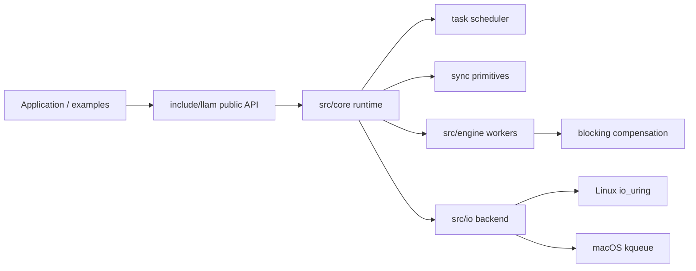

# LLAM

<p align="center">
  
</p>


LLAM is a stackful user-thread runtime for C applications. It lets C code express concurrency with task-oriented APIs such as `spawn`, `join`, `sleep`, channels, `read`, `write`, `accept`, `connect`, and `poll`, while the runtime schedules many user tasks over a smaller set of OS worker threads.

LLAM is not Linux-only. The Linux backend uses io_uring/liburing, and the macOS/Darwin backend uses kqueue-based watch and completion paths.

## Key Features

- Stackful tasks with natural C control flow.
- N:M scheduling over runtime worker threads.
- Linux I/O backend based on io_uring/liburing.
- macOS/Darwin I/O backend based on kqueue.
- Task primitives: `spawn`, `yield`, `join`, `sleep`, deadlines, and task metadata.
- Synchronization primitives: mutex, condition variable, channel, and cancellation token.
- Blocking integration through `llam_call_blocking`, `llam_enter_blocking`, and `llam_leave_blocking`.
- Runtime tuning through profiles, dynamic workers, worker rings, SQPOLL, and idle-spin controls.
- Observability through runtime stats and debug dumps.
- Stable ABI metadata for dynamic language-runtime loaders.
- Static and shared library build targets.
- Built-in demo, stress, benchmark, Docker verification, and Go/Tokio comparison scripts.

## Platform Support

| Platform | Status | I/O backend | Recommended compiler | Verification |
| --- | --- | --- | --- | --- |
| Linux x86_64 | Primary Linux path | io_uring/liburing | GCC or Clang | `make verify-linux CC=gcc` |
| Linux aarch64 | Supported | io_uring/liburing | GCC or Clang | `make verify-linux CC=gcc` |
| macOS arm64 | Primary macOS path | kqueue | Apple Clang | `CC=clang make verify-darwin` |
| macOS x86_64 | Portable context fallback path | kqueue | Apple Clang | `CC=clang make verify-darwin` |
| Windows | API/build boundary scaffold only | Not complete | MSVC/MinGW planned | `scripts/verify_windows.ps1` |

Native Windows runtime support is not complete. Use WSL/Linux if you need a working Windows-hosted path today.

## Getting Started

Install Linux/WSL dependencies:

```bash
sudo apt install build-essential liburing-dev
```

Install macOS command-line tools:

```bash
xcode-select --install
```

Build on Linux:

```bash
make -j4 CC=gcc
```

Build on macOS:

```bash
CC=clang make -j4
```

Build with CMake:

```bash
cmake -S . -B build -DCMAKE_BUILD_TYPE=Release
cmake --build build -j4
```

Run the included programs:

```bash
./demo
./stress
./bench
```

Run focused API/ABI tests:

```bash
make test
```

Build outputs:

- `demo`: runnable examples of the public runtime API.
- `stress`: regression coverage for scheduling, sync, timeouts, I/O, and dynamic workers.
- `bench`: microbenchmarks for spawn/join, channels, I/O, poll, sleep fanout, and opaque blocking.
- `test_abi_contract`: ABI metadata, size handshakes, and legacy compatibility checks.
- `test_connect_io`: direct and runtime-managed `llam_connect()` success and invalid-input checks.
- `test_shared_load`: `dlopen()` coverage for the shared library ABI surface.

## Using LLAM In An Application

The top-level Makefile builds the bundled executables directly. For application integration, the simplest path is the CMake target `llam_runtime`.

```cmake
add_subdirectory(path/to/LLAM)

add_executable(my_app main.c)
target_link_libraries(my_app PRIVATE llam_runtime)
```

Use `llam_runtime_shared` when a language runtime needs to load LLAM dynamically.
The Makefile equivalent is `make shared`.

Release archives include the public headers, docs, `demo`, `stress`, `bench`,
`libllam_runtime.a`, and the platform shared library. Tag pushes such as
`v0.1.0` build and publish archives for Linux x86_64, Linux aarch64, macOS
x86_64, and macOS arm64 through `.github/workflows/release.yml`.

Include the canonical public API:

```c
#include "llam/runtime.h"
```

`include/llam/nm_runtime.h` and `include/nm_runtime.h` provide compatibility for the older `nm_*` API names. New code should prefer the `llam_*` API.

Dynamic loaders should check `llam_abi_version()` or `llam_abi_get_info()` before binding the rest of the API. The ABI and semantic contract is documented in `docs/abi.md`.

## Execution Model

A typical LLAM program follows this lifecycle:

1. Initialize the runtime with `llam_runtime_init()`.
2. Spawn one or more root tasks with `llam_spawn()`.
3. Run the scheduler with `llam_run()`.
4. Shut the runtime down with `llam_runtime_shutdown()`.

```c
#include "llam/runtime.h"

#include <stdio.h>

static void worker(void *arg) {
    const char *name = arg;

    printf("hello from %s\n", name);
    llam_yield();
    printf("bye from %s\n", name);
}

int main(void) {
    if (llam_runtime_init(NULL) != 0) {
        return 1;
    }

    if (llam_spawn(worker, "LLAM", NULL) == NULL) {
        llam_runtime_shutdown();
        return 1;
    }

    int rc = llam_run();
    llam_runtime_shutdown();
    return rc;
}
```

## Task, Join, And Sleep

A task is a `void (*)(void *)` function. Pass shared state through the task argument and use `llam_join()` when a parent task needs the child to finish.

```c
#include "llam/runtime.h"

#include <stdint.h>
#include <stdio.h>

typedef struct job {
    int input;
    int output;
} job_t;

static void child(void *arg) {
    job_t *job = arg;

    llam_sleep_ns(1ULL * 1000ULL * 1000ULL);
    job->output = job->input * job->input;
}

static void root(void *arg) {
    (void)arg;

    job_t job = {.input = 12};
    llam_task_t *task = llam_spawn(child, &job, NULL);

    if (task != NULL && llam_join(task) == 0) {
        printf("result=%d\n", job.output);
    }
}
```

Deadline-based APIs use absolute timestamps from `llam_now_ns()`.

```c
uint64_t deadline = llam_now_ns() + 10ULL * 1000ULL * 1000ULL;
int rc = llam_join_until(task, deadline);
```

## Channels

A channel transfers pointer values between tasks. Capacity `0` behaves like a rendezvous channel. Capacity `1` or greater behaves like a bounded buffer.

```c
#include "llam/runtime.h"

#include <stdio.h>

typedef struct pipe_state {
    llam_channel_t *channel;
} pipe_state_t;

static void producer(void *arg) {
    pipe_state_t *state = arg;

    (void)llam_channel_send(state->channel, "ping");
    (void)llam_channel_send(state->channel, "pong");
    (void)llam_channel_close(state->channel);
}

static void consumer(void *arg) {
    pipe_state_t *state = arg;
    const char *msg;

    while ((msg = llam_channel_recv(state->channel)) != NULL) {
        printf("recv=%s\n", msg);
    }
}

static void root(void *arg) {
    (void)arg;

    pipe_state_t state = {
        .channel = llam_channel_create(2),
    };

    if (state.channel == NULL) {
        return;
    }

    llam_task_t *a = llam_spawn(producer, &state, NULL);
    llam_task_t *b = llam_spawn(consumer, &state, NULL);

    if (a != NULL) {
        (void)llam_join(a);
    }
    if (b != NULL) {
        (void)llam_join(b);
    }
    llam_channel_destroy(state.channel);
}
```

## I/O

LLAM I/O calls are written like blocking calls from inside a task, while the runtime backend handles readiness and completion. Linux uses io_uring, and macOS uses kqueue. The I/O primitive set covers `read`, `write`, `accept`, `connect`, `poll`, and owned-buffer reads.

```c
#include "llam/runtime.h"

#include <stdio.h>
#include <string.h>
#include <sys/socket.h>
#include <unistd.h>

typedef struct echo_state {
    int reader;
    int writer;
} echo_state_t;

static void reader_task(void *arg) {
    echo_state_t *state = arg;
    char buf[64];

    ssize_t n = llam_read(state->reader, buf, sizeof(buf));
    if (n > 0) {
        printf("read=%.*s\n", (int)n, buf);
    }
}

static void writer_task(void *arg) {
    echo_state_t *state = arg;
    const char *msg = "hello";

    (void)llam_write(state->writer, msg, strlen(msg));
}

static void root(void *arg) {
    (void)arg;

    int sv[2];
    if (socketpair(AF_UNIX, SOCK_STREAM, 0, sv) != 0) {
        return;
    }

    echo_state_t state = {
        .reader = sv[0],
        .writer = sv[1],
    };

    llam_task_t *reader = llam_spawn(reader_task, &state, NULL);
    llam_task_t *writer = llam_spawn(writer_task, &state, NULL);

    if (reader != NULL) {
        (void)llam_join(reader);
    }
    if (writer != NULL) {
        (void)llam_join(writer);
    }

    close(sv[0]);
    close(sv[1]);
}
```

The owned-buffer API lets the runtime allocate the I/O buffer. Release it with `llam_io_buffer_release()`.

```c
llam_io_buffer_t *buffer = NULL;
ssize_t n = llam_read_owned(fd, 4096, &buffer);

if (n > 0 && buffer != NULL) {
    void *data = llam_io_buffer_data(buffer);
    size_t size = llam_io_buffer_size(buffer);
    (void)data;
    (void)size;
}
llam_io_buffer_release(buffer);
```

## Blocking Work

Long CPU work or blocking syscalls can pin a worker if they run directly inside a task. Use `llam_call_blocking()` to offload such work, or wrap explicit blocking regions with `llam_enter_blocking()` and `llam_leave_blocking()`.

```c
#include "llam/runtime.h"

#include <unistd.h>

static void *slow_syscall(void *arg) {
    (void)arg;
    sleep(1);
    return NULL;
}

static void task(void *arg) {
    (void)arg;

    (void)llam_call_blocking(slow_syscall, NULL);
}
```

Manual blocking region:

```c
if (llam_enter_blocking() == 0) {
    /* Run a blocking syscall or external library call here. */
    llam_leave_blocking();
}
```

## Public API Summary

Runtime lifecycle:

| API | Purpose |
| --- | --- |
| `llam_runtime_init` | Initialize the runtime. |
| `llam_runtime_shutdown` | Shut the runtime down and release resources. |
| `llam_runtime_collect_stats` | Collect scheduler, I/O, blocking, and queue statistics. |

Task scheduling:

| API | Purpose |
| --- | --- |
| `llam_spawn` | Create a task. |
| `llam_run` | Run the scheduler. |
| `llam_yield` | Yield the current task. |
| `llam_join` | Wait for task completion. |
| `llam_join_until` | Wait for task completion until a deadline. |
| `llam_sleep_ns` | Sleep for a duration. |
| `llam_sleep_until` | Sleep until an absolute deadline. |
| `llam_task_set_class` | Change the current task class. |
| `llam_current_task` | Return the current task handle. |
| `llam_task_id` | Return a task id. |
| `llam_task_state_name` | Return a task state string. |
| `llam_task_class` | Return a task class. |
| `llam_task_flags` | Return task flags. |

Spawn options:

| Type/value | Meaning |
| --- | --- |
| `LLAM_TASK_CLASS_LATENCY` | Latency-sensitive task. |
| `LLAM_TASK_CLASS_DEFAULT` | Default task class. |
| `LLAM_TASK_CLASS_BATCH` | Batch-oriented task. |
| `LLAM_STACK_CLASS_DEFAULT` | Default stack size class. |
| `LLAM_STACK_CLASS_LARGE` | Larger stack size class. |
| `LLAM_STACK_CLASS_HUGE` | Very large stack size class. |
| `LLAM_SPAWN_F_PINNED` | Hint that the task should stay pinned. |
| `LLAM_SPAWN_F_NO_PREEMPT` | Hint that preemption should be restricted. |
| `LLAM_SPAWN_F_SYS_TASK` | Runtime/system task hint. |
| `LLAM_SPAWN_F_LATENCY_CRITICAL` | Latency-critical task hint. |

Blocking:

| API | Purpose |
| --- | --- |
| `llam_call_blocking` | Run a blocking function through the runtime blocking path. |
| `llam_enter_blocking` | Mark the current task as entering a blocking region. |
| `llam_leave_blocking` | Mark the current task as leaving a blocking region. |

Cancellation:

| API | Purpose |
| --- | --- |
| `llam_cancel_token_create` | Create a cancellation token. |
| `llam_cancel_token_destroy` | Destroy a cancellation token. |
| `llam_cancel_token_cancel` | Request cancellation. |
| `llam_cancel_token_is_cancelled` | Check cancellation state. |

Mutex and condition variables:

| API | Purpose |
| --- | --- |
| `llam_mutex_create` / `llam_mutex_destroy` | Create or destroy a mutex. |
| `llam_mutex_lock` / `llam_mutex_unlock` | Lock or unlock a mutex. |
| `llam_mutex_lock_until` | Wait for a mutex until a deadline. |
| `llam_mutex_trylock` | Try to lock immediately. |
| `llam_cond_create` / `llam_cond_destroy` | Create or destroy a condition variable. |
| `llam_cond_wait` | Wait on a condition variable. |
| `llam_cond_wait_until` | Wait on a condition variable until a deadline. |
| `llam_cond_signal` | Wake one waiter. |
| `llam_cond_broadcast` | Wake all waiters. |

Channels:

| API | Purpose |
| --- | --- |
| `llam_channel_create` / `llam_channel_destroy` | Create or destroy a channel. |
| `llam_channel_send` | Send a value. |
| `llam_channel_send_until` | Send a value until a deadline. |
| `llam_channel_recv` | Receive a value. |
| `llam_channel_recv_until` | Receive a value until a deadline. |
| `llam_channel_close` | Close a channel. |

I/O:

| API | Purpose |
| --- | --- |
| `llam_read` | Read from an fd. |
| `llam_write` | Write to an fd. |
| `llam_read_owned` | Read into a runtime-owned buffer. |
| `llam_recv_owned` | Receive with flags into a runtime-owned buffer. |
| `llam_io_buffer_release` | Release an owned buffer. |
| `llam_io_buffer_data` | Return the owned buffer data pointer. |
| `llam_io_buffer_size` | Return the number of bytes read. |
| `llam_io_buffer_capacity` | Return owned buffer capacity. |
| `llam_accept` | Accept a connection from a listener fd. |
| `llam_connect` | Connect a socket without blocking the scheduler worker. |
| `llam_poll_fd` | Wait for fd readiness. |

Time, debug, and platform:

| API | Purpose |
| --- | --- |
| `llam_now_ns` | Return a monotonic nanosecond timestamp. |
| `llam_dump_runtime_state` | Dump runtime state to an fd. |
| `llam_fd_t` | Platform-specific fd/socket handle type. |
| `LLAM_PLATFORM_LINUX` | Linux build flag. |
| `LLAM_PLATFORM_DARWIN` | macOS/Darwin build flag. |
| `LLAM_PLATFORM_WINDOWS` | Windows build flag. |
| `LLAM_PLATFORM_NAME` | Platform name string. |

## Runtime Options

Pass `NULL` to `llam_runtime_init()` for the default runtime configuration. Pass `llam_runtime_opts_t` when you need explicit tuning.

```c
llam_runtime_opts_t opts = {
    .deterministic = 0,
    .forced_yield_every = 0,
    .experimental_dynamic_workers = 1,
    .experimental_lockfree_normq = 1,
    .profile = LLAM_RUNTIME_PROFILE_BALANCED,
};

if (llam_runtime_init(&opts) != 0) {
    return 1;
}
```

Important fields:

| Field | Meaning |
| --- | --- |
| `deterministic` | Deterministic scheduling mode. |
| `forced_yield_every` | Force a yield at a fixed interval. |
| `experimental_worker_rings` | Experimental per-worker I/O ring mode. |
| `experimental_worker_rings_multishot` | Allow multishot watches with worker rings. |
| `experimental_dynamic_workers` | Soft-park and reactivate idle workers. |
| `experimental_lockfree_normq` | Use the lock-free normal queue. |
| `experimental_huge_alloc` | Prefer hugepage-friendly allocator backing. |
| `idle_spin_ns` | Spin before idle poll fallback. |
| `idle_spin_max_iters` | Maximum idle-spin iterations. |
| `experimental_sqpoll` | Experimental Linux io_uring SQPOLL mode. |
| `sqpoll_cpu` | CPU reserved for SQPOLL. |
| `profile` | Runtime policy profile: balanced, release-fast, debug-safe, or io-latency. |

Selected environment variables:

| Variable | Example values | Meaning |
| --- | --- | --- |
| `LLAM_RUNTIME_PROFILE` | `balanced`, `release-fast`, `debug-safe`, `io-latency` | Override the runtime profile. |
| `LLAM_EXPERIMENTAL_DYNAMIC_WORKERS` | `0`, `1` | Toggle dynamic workers. |
| `LLAM_EXPERIMENTAL_LOCKFREE_NORMQ` | `0`, `1` | Toggle the lock-free normal queue. |
| `LLAM_EXPERIMENTAL_WORKER_RINGS` | `0`, `1` | Toggle worker ring mode. |
| `LLAM_EXPERIMENTAL_WORKER_RINGS_MULTISHOT` | `0`, `1` | Toggle worker-ring multishot watches. |
| `LLAM_EXPERIMENTAL_HUGE_ALLOC` | `0`, `1` | Toggle huge allocator mode. |
| `LLAM_EXPERIMENTAL_SQPOLL` | `0`, `1` | Toggle Linux SQPOLL. |
| `LLAM_SQPOLL_CPU` | CPU number | Select the SQPOLL CPU. |
| `LLAM_IDLE_SPIN_NS` | nanoseconds | Idle spin time. |
| `LLAM_IDLE_SPIN_ITERS` | iteration count | Idle spin iteration limit. |

## Benchmarks

Run all LLAM benchmark cases:

```bash
./bench
```

Run one benchmark case:

```bash
LLAM_BENCH_ONLY=spawn_join ./bench
LLAM_BENCH_ONLY=channel_pingpong ./bench
LLAM_BENCH_ONLY=io_echo ./bench
LLAM_BENCH_ONLY=poll_wake ./bench
LLAM_BENCH_ONLY=sleep_fanout ./bench
LLAM_BENCH_ONLY=opaque_block ./bench
```

Scale benchmark size:

```bash
LLAM_BENCH_ROUNDS=31 LLAM_BENCH_WARMUP_ROUNDS=5 ./bench
LLAM_BENCH_SPAWN_TASKS=512 ./bench
LLAM_BENCH_CHANNEL_MESSAGES=4096 ./bench
LLAM_BENCH_IO_MESSAGES=512 ./bench
LLAM_BENCH_POLL_EVENTS=512 ./bench
LLAM_BENCH_SLEEP_TASKS=1024 ./bench
LLAM_BENCH_OPAQUE_SCOPES=64 ./bench
```

Compare against Go:

```bash
go run scripts/bench_go_compare.go
```

Compare LLAM, Go, and Tokio:

```bash
python3 scripts/bench_runtime_compare.py --runtime all
```

Graph generation requires Python `matplotlib`. Without it, the script still writes CSV and prints tables.

Run the benchmark matrix:

```bash
make bench-matrix
```

## Verification And Cleanup

Run focused tests:

```bash
make test
```

Build a local release archive:

```bash
make clean all test
./scripts/package_release.sh
```

Verify Linux:

```bash
make verify-linux CC=gcc
```

Verify Linux with experimental paths:

```bash
LLAM_VERIFY_LINUX_EXPERIMENTAL=1 make verify-linux CC=gcc
```

Verify macOS:

```bash
CC=clang make verify-darwin
```

Verify macOS with experimental paths:

```bash
LLAM_VERIFY_DARWIN_EXPERIMENTAL=1 CC=clang make verify-darwin
```

Verify Linux in Docker:

```bash
./scripts/docker_verify_linux.sh
```

Remove generated files:

```bash
make clean
```

`make clean` removes generated files such as `object/`, `build/`, CMake cache files, example and benchmark binaries, and `perf.data*`.

## Architecture



Technology stack:

- C11
- GCC, Clang, and Apple Clang
- Make and CMake
- pthread
- Linux io_uring/liburing
- macOS kqueue
- x86_64/aarch64 assembly context switch paths
- Portable `ucontext` fallback path

Source layout:

- `include/llam`: public API.
- `src/core`: runtime lifecycle, scheduler, task, sync, timer, and stats.
- `src/io`: Linux io_uring and Darwin/kqueue I/O backends.
- `src/engine`: workers, watchdog, and blocking compensation.
- `src/asm`: platform-specific context switch assembly.
- `examples`: demo, stress, and benchmark programs.
- `scripts`: verification and benchmark helper scripts.
- `docker`: Linux verification Dockerfiles.

## License

LLAM is licensed under the [Apache License 2.0](LICENSE).
