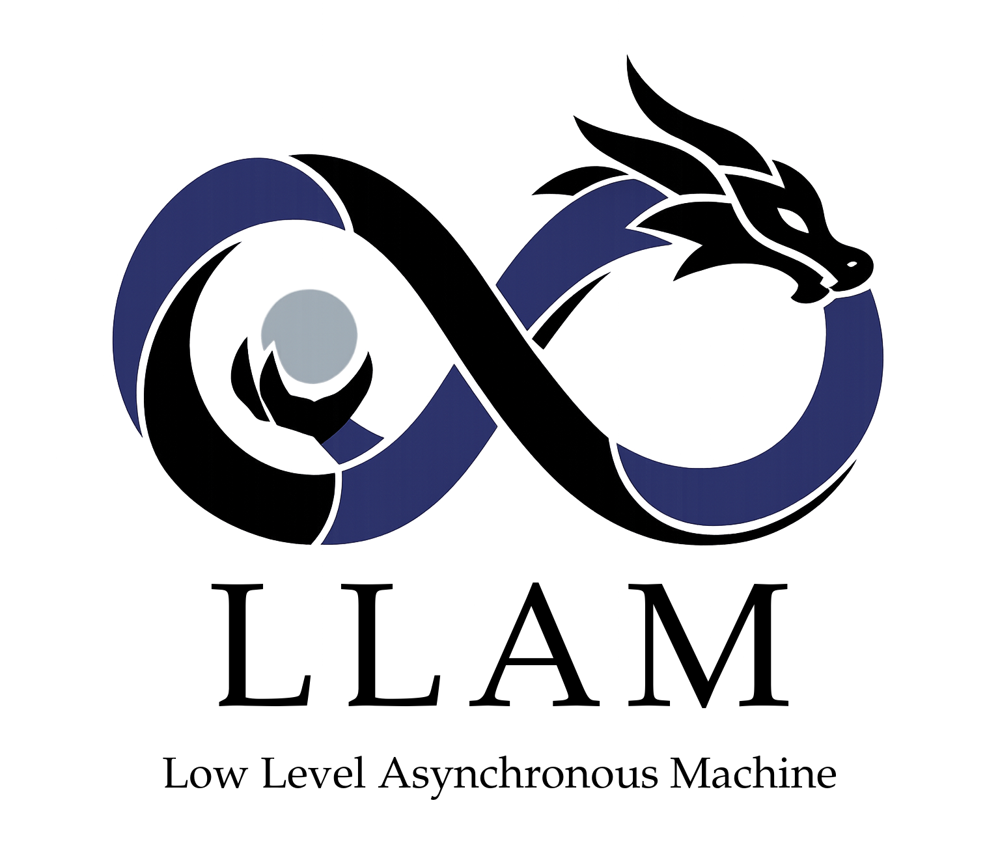
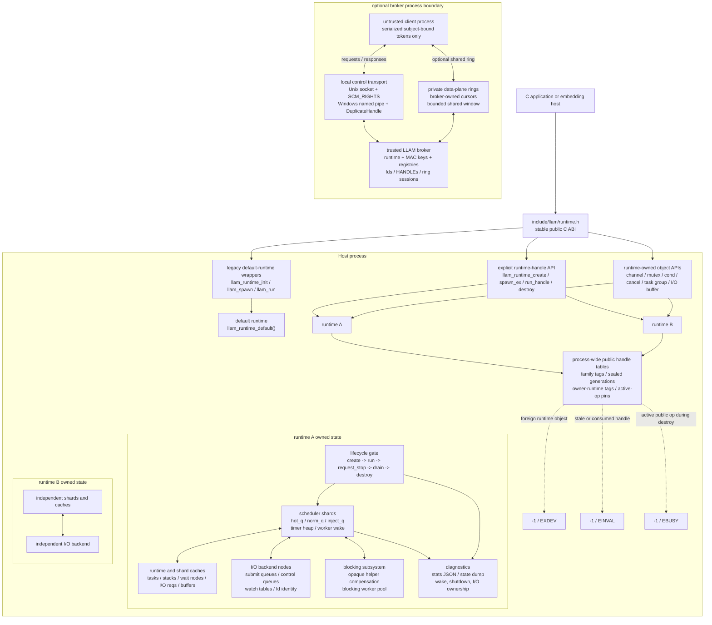
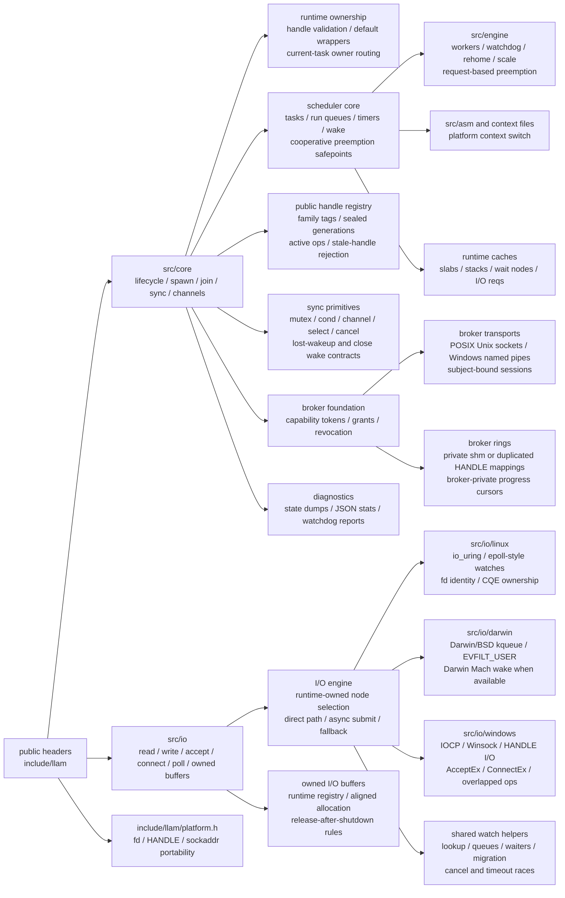
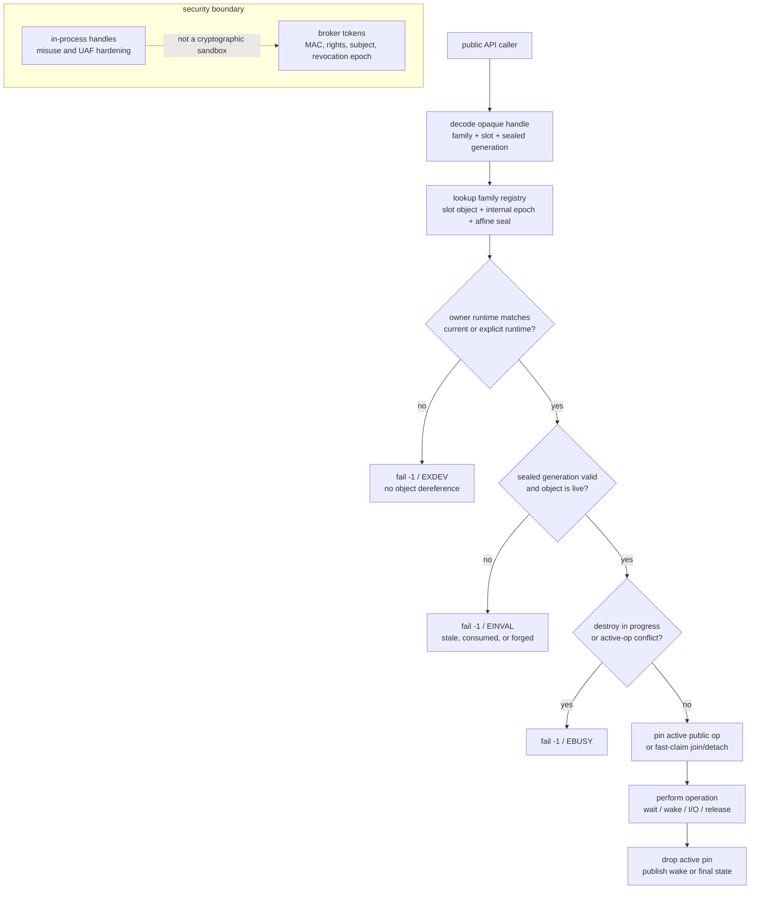
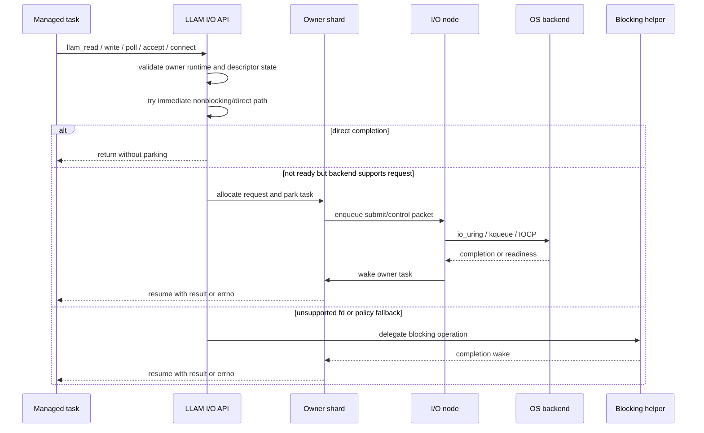

# LLAM

<p align="center">
  
</p>


LLAM is a stackful user-thread runtime for C applications. It lets C code express concurrency with task-oriented APIs such as `spawn`, `join`, `sleep`, channels, `read`, `write`, `accept`, `connect`, and `poll`, while the runtime schedules many user tasks over a smaller set of OS worker threads.

LLAM is not Linux-only. The Linux backend uses io_uring/liburing, macOS/Darwin
and BSD use kqueue-based watch and completion paths, and the native Windows
10/11 backend uses IOCP for overlapped Winsock `read`/`write`/`accept`/`connect`
plus generic HANDLE `ReadFile`/`WriteFile` requests.

## Key Features

- Stackful tasks with natural C control flow.
- N:M scheduling over runtime worker threads.
- Linux I/O backend based on io_uring/liburing.
- macOS/Darwin I/O backend based on kqueue.
- FreeBSD, OpenBSD, NetBSD, and DragonFly BSD kqueue backend wiring.
- Windows 10/11 backend with IOCP request completions for sockets and overlapped HANDLEs, Windows wake handles, and x86_64 context-switch assembly.
- Task primitives: `spawn`, `yield`, `join`, `sleep`, deadlines, and task metadata.
- Synchronization primitives: mutex, condition variable, channel, and cancellation token.
- Channel multiplexing with `llam_channel_select()` and focused select benchmarks.
- Blocking integration through `llam_call_blocking`, `llam_enter_blocking`, and `llam_leave_blocking`.
- Runtime tuning through profiles, dynamic workers, worker rings, SQPOLL, and idle-spin controls.
- Observability through runtime stats and debug dumps.
- Stable ABI metadata and explicit runtime-handle APIs for embedders.
- Internal broker/capability foundation for out-of-process isolation experiments.
- Static and shared library build targets.
- Built-in demo, chat server, stress, benchmark, Docker verification, and Go/Tokio comparison scripts.

## Platform Support

| Platform | Status | I/O backend | Recommended compiler | Verification |
| --- | --- | --- | --- | --- |
| Linux x86_64 | Primary Linux path | io_uring/liburing | GCC or Clang | `make verify-linux CC=gcc` |
| Linux aarch64 | Supported | io_uring/liburing | GCC or Clang | `make verify-linux CC=gcc` |
| macOS arm64 | Primary macOS path | kqueue | Apple Clang | `CC=clang make verify-darwin` |
| macOS x86_64 | Supported | kqueue + x86_64 asm context switch | Apple Clang | `CC=clang make verify-darwin` |
| FreeBSD x86_64 | BSD CI smoke path | kqueue + x86_64 asm context switch | Clang or GCC with GNU Make | `.github/workflows/bsd.yml` core/API/I/O-buffer smoke |
| OpenBSD x86_64 | BSD CI smoke path | kqueue + x86_64 asm context switch | Clang or GCC with GNU Make | `.github/workflows/bsd.yml` core/API/I/O-buffer smoke |
| NetBSD x86_64 | BSD CI smoke path | kqueue + x86_64 asm context switch | Clang or GCC with GNU Make | `.github/workflows/bsd.yml` core/API/I/O-buffer smoke |
| DragonFly BSD x86_64 | BSD CI smoke path | kqueue + x86_64 asm context switch | Clang or GCC with GNU Make | `.github/workflows/bsd.yml` core/API/I/O-buffer smoke |
| Windows 10/11 | Supported native x86_64 backend | IOCP for WSARecv/WSASend/AcceptEx/ConnectEx, overlapped HANDLE ReadFile/WriteFile, plus gated TCP `POLLOUT` and UDP `POLLIN`; TCP `POLLIN` defaults to fallback unless `LLAM_WINDOWS_IOCP_TCP_POLLIN=1` is enabled | MSVC/MASM or MinGW through CMake; Makefile delegates to that CMake path on Windows | CMake Windows build plus runtime core/API/shutdown/buffer tests, `test_windows_policy`, `test_windows_runtime_smoke`, `test_windows_iocp_io`, and `test_windows_handle_io`; `scripts/verify_windows.ps1 -Native` |

BSD support shares the kqueue watch backend with Darwin where the kernel
contract is common, while Darwin-only Mach wake and scheduler hints remain
guarded behind Darwin-specific code. The BSD CI matrix is the current support
gate; long soak and platform-specific performance tuning still trail Linux and
macOS until native runner history is available.

Native Windows runtime support covers scheduler/core, wake handles, x86_64 context switching, IOCP-backed socket requests, and overlapped HANDLE I/O. Windows 10 and Windows 11 use the same public API; LLAM selects conservative Windows 10 tuning or batched Windows 11 tuning at runtime, and CI forces both policy branches on native Windows runners.
On Windows 11 policy, associated socket/HANDLE objects attempt
`FILE_SKIP_COMPLETION_PORT_ON_SUCCESS`; synchronous overlapped successes on
accepted handles are completed inline through the same finalizer used for queued
IOCP packets. Runtime dumps include `windows_skip(...)` counters to show whether
the host accepted that mode and how often it avoided a completion-port round
trip.

Production and stress-operation guidance is documented in `docs/operations.md`.
The in-process handle and out-of-process broker threat boundaries are
documented in `docs/security.md`; in-process opaque handles are misuse/UAF
hardening, not protection against arbitrary same-process memory read/write.

## Getting Started

Install Linux/WSL dependencies:

```bash
sudo apt install build-essential liburing-dev
```

Install macOS command-line tools:

```bash
xcode-select --install
```

Install BSD dependencies:

```sh
# FreeBSD / DragonFly
sudo pkg install -y gmake

# OpenBSD
sudo pkg_add gmake

# NetBSD
sudo pkgin -y install gmake
```

Build on Linux:

```bash
make -j4 CC=gcc
```

Build on macOS:

```bash
CC=clang make -j4
```

Build on BSD:

```sh
gmake -j4 CC=cc
```

Build native Windows with CMake:

```powershell
cmake -S . -B build-windows -G "Ninja" -DCMAKE_BUILD_TYPE=Release -DLLAM_ENABLE_WINDOWS_BACKEND=ON
cmake --build build-windows
ctest --test-dir build-windows --output-on-failure
```

The top-level Makefile is also usable from a Windows shell with `make`
available. On Windows it delegates to the same native CMake backend instead of
trying to compile the MSVC/MASM path directly:

```powershell
make all
make test
make verify-windows
```

Use `WINDOWS_CMAKE_ARGS` to select a generator when needed, for example
`make all WINDOWS_CMAKE_ARGS="-G Ninja"`.

`.\scripts\verify_windows.ps1` still verifies the Linux backend through WSL. `.\scripts\verify_windows.ps1 -Native` builds the native Windows CMake targets and runs the Windows CTest suite.

Build with CMake:

```bash
cmake -S . -B build -DCMAKE_BUILD_TYPE=Release
cmake --build build -j4
```

Install with CMake:

```bash
cmake --install build --prefix "$HOME/.local"
```

Run the included programs:

```bash
./demo
./stress
./bench
./server 7777
./server_lossless 7777
```

Stress the chat server with real TCP clients:

```bash
make server-stress
python3 scripts/stress_server.py --clients 64 --messages 16 --payload-bytes 64
```

Run the native maximum-throughput flood driver:

```bash
make server-flood
./server_flood --server ./server --server-best-effort \
  --clients 16 --duration 60 --message-bytes 8 --batch 64 --target-mps 0.30
```

`server_flood` reports both inbound messages/sec and observed broadcast
deliveries/sec. For chat fanout, one inbound message can produce `clients - 1`
peer deliveries, so million-level delivery rates can appear before inbound
message rates reach the same scale.

`server` is intentionally a bounded-outbox, best-effort chat backend. Under
high-rate fanout, slow clients can overflow their outbox and lose per-client
deliveries; `server_flood` reports those drops through the server stats file.
Use `server_lossless`, `./server --lossless`, or `LLAM_CHAT_LOSSLESS=1 ./server`
when the test must apply producer backpressure instead of dropping outbox
entries. `server_flood --server-lossless` starts the target server in that
mode, while `--server-best-effort` pins the bounded-drop throughput policy.

Run the full composite server stress suite:

```bash
make test-quick
make test-full
make test-soak
make server-stress-composite
make server-stress-composite-quick
make server-stress-composite-hour
python3 scripts/stress_server_composite.py --quick
python3 scripts/stress_server_composite.py --quick --seed 1234
```

The composite suite combines exact fanout checks, 60-second native flood,
payload-size variation, connection churn, slow receivers, half-close/reset
patterns, and RSS/fd sampling. Edge logs split client socket failures into
expected churn/cleanup errors and `unexpected_client_errors`; the latter must
stay at zero. Pass `--seed N` to replay randomized correctness payloads and
edge churn behavior from a previous run.

`--quick` is intended for hosted CI runners. It keeps exact-delivery checks but
uses a lower absolute flood delivery threshold than the standard profile.

The one-hour profile runs the same classes of checks with a long soak layout:
30 minutes of main flood, two 5-minute payload flood phases, and 20 minutes of
mixed edge stress. It keeps the high-rate best-effort flood load, but treats
the run as a stability/accounting soak rather than a throughput benchmark:
zero traffic, missing stats, accounting gaps, closed-outbox drops, forced
server stop, resource-limit violations, and unexpected edge client errors still
fail the run; absolute delivery-MPS regression checks are left to the standard
Stress workflow and scheduled benchmark jobs.

Run focused API/ABI tests:

```bash
make test
```

`make test-quick` runs API/ABI tests plus the quick composite server suite.
`make test-full` runs API/ABI tests plus the standard composite suite.
`make test-soak` runs API/ABI tests plus the hour-long soak profile.
`make test-fuzz-heavy` runs the deterministic runtime fuzz suite at its
maximum built-in scenario counts for single-runtime and multi-runtime cases.
`make test-process-utils` verifies the CI process wrapper helpers, including
timeout cleanup of descendant processes so hung benchmark or soak wrappers do
not pollute later jobs.
`make test-runtime-soak` runs a time-bounded direct LLAM core soak loop over
runtime fuzz, multi-runtime ownership/isolation, runtime stress, shutdown, and
owned-buffer tests without involving the example chat server. Override
`RUNTIME_SOAK_SECONDS`, `RUNTIME_SOAK_SEED`, and the `RUNTIME_SOAK_*SCENARIOS`
variables to scale local or CI coverage.
`make test-hardening` runs the release-candidate hardening gate: C static
analysis, dependency audit, ASan/UBSan, TSan, and heavy runtime fuzz.

GitHub Actions is split by cost and depth:

- `linux`, `macos`, and `Stress` are PR/push gates.
- `Stress` repeats `test_runtime_stress`, pins/reports server stress seeds, streams long stress logs through `scripts/run_with_timeout.py`, and uploads diagnostics logs on failure or timeout.
- `Nightly Deep CI` runs longer POSIX/Windows stress, deterministic runtime fuzz, ASan/UBSan, experimental TSan, and benchmark guardrails from `.github/workflows/nightly.yml`.
- `Weekly Soak` runs direct runtime soak plus the hour-long stability/accounting composite profile on Linux x86_64 and macOS arm64 from `.github/workflows/soak.yml`.
- `Runtime Benchmarks` runs scheduled LLAM/Go/Tokio benchmark comparisons and uploads graphs/results.

Current reliability coverage is split between direct runtime tests and the
example server. Direct runtime tests own LLAM correctness for lifecycle,
task-handle ownership, cancellation, lost wakeups, channel close/select,
blocking callbacks, managed/unmanaged API boundaries, owned I/O buffers, and
runtime diagnostics. The chat server stress suite is an integration workload:
lossless phases prove exact fanout under backpressure, while best-effort flood
phases allow bounded outbox drops and require those drops to be fully explained
by server-side accounting.

Build outputs:

- `demo`: runnable examples of the public runtime API.
- `stress`: regression coverage for scheduling, sync, timeouts, I/O, and dynamic workers.
- `bench`: microbenchmarks for spawn/join, channels, channel select, I/O, poll, sleep fanout, and opaque blocking.
- `server`: minimal LLAM-backed TCP chat backend for local best-effort testing.
- `server_lossless`: the same chat backend built with lossless outbox backpressure enabled by default.
- `server_flood`: native nonblocking throughput flood driver for the chat server.
- `scripts/bench_guard.py`: conservative hard-fail regression guard for scheduler, channel, select, I/O echo, and poll-wake throughput.
- `scripts/run_with_timeout.py`: CI-safe long-process runner that preserves partial logs, broadcasts POSIX dump signals to wrapped runtimes, and cleans up hung stress jobs plus descendants.
- `scripts/stress_server.py`: TCP fanout stress test for the chat server.
- `scripts/stress_server_composite.py`: long-running composite server stability suite.
- `test_abi_contract`: ABI metadata and size handshakes.
- `test_abi_compat`: old-prefix option/stat struct compatibility.
- `test_connect_io`: direct and runtime-managed `llam_connect()` success and invalid-input checks.
- `test_runtime_core`: lifecycle, task metadata, yielding, sleeping, blocking callbacks, and stats checks.
- `test_multi_runtime_core`: explicit runtime-handle ownership, shutdown isolation, and cross-runtime misuse checks.
- `test_runtime_api_edges`: focused public API edge coverage for task ownership, cancellation, channel close/drain, blocking callbacks, cond/mutex deadlines, and managed/unmanaged call boundaries.
- `test_runtime_select_edges`: focused `llam_channel_select()` send/close/cancel race coverage for lost-wakeup attribution outside the example server.
- `test_runtime_io_dump`: focused live-I/O diagnostic coverage proving a parked fd-readiness wait appears in `llam_dump_runtime_state()` either as native request ownership or as an explicit blocking fallback job.
- `test_runtime_group_local_edges`: focused task-local isolation and structured task-group join/cancel/destroy ownership coverage.
- `test_runtime_shutdown_internal`: focused shutdown-internal coverage for partial initialization, stop-time wakeup, and internal resource cleanup.
- `test_runtime_stress`: direct LLAM scheduler, cancel, channel, condvar, nested spawn, and I/O cancel stress.
- `test_runtime_fuzz`: deterministic randomized scheduler/cancel/channel scenarios; `make test-fuzz-heavy` raises it to the maximum built-in scenario counts, while `make test-runtime-soak` repeats it with changing seeds alongside direct multi-runtime/stress/shutdown/I/O tests.
- `test_sync_primitives`: mutex, condition variable, channel, timeout, and close semantics.
- `test_io_buffers`: direct and managed poll/read/write, owned buffers, and `MSG_PEEK`.
- `test_windows_policy`: Windows 10/11 policy selection and environment override checks.
- `test_windows_runtime_smoke`: native Windows scheduler/backend smoke coverage.
- `test_windows_iocp_io`: Windows-only IOCP socket/HANDLE I/O smoke coverage.
- `test_windows_iocp_dump`: Windows-only IOCP pending-request dump coverage for parked `AcceptEx` ownership.
- `test_windows_handle_io`: Windows-only HANDLE read/write coverage.
- `test_security_capability`: broker capability, token, transport, ring, descriptor, and stale-output hardening checks.
- `test_shared_load`: `dlopen()` coverage for the shared library ABI surface.
- `llam_broker`: internal broker-control self-test and local client/server smoke harness.

## Using LLAM In An Application

The top-level Makefile builds the bundled executables directly. For application integration, the simplest path is the CMake target `llam_runtime`.

```cmake
add_subdirectory(path/to/LLAM)

add_executable(my_app main.c)
target_link_libraries(my_app PRIVATE llam_runtime)
```

Use `llam_runtime_shared` when a language runtime needs to load LLAM dynamically.
The Makefile equivalent is `make shared`.

Release archives include the public headers, docs, bundled examples, runtime
libraries, `pkg-config` metadata, and CMake package files. Tag pushes such as
`v2.0.0` build and publish `.tar.xz` archives for Linux x86_64, Linux aarch64,
macOS x86_64, macOS arm64, and BSD targets that pass the BSD CI smoke gate, plus
a native Windows x86_64 `.zip` archive through `.github/workflows/release.yml`.

The 2.x release gate is platform-local plus sanitizer-backed: Linux must pass
`make verify-linux` or Docker verification, macOS must pass the Darwin verify
path, BSD targets must pass the VM smoke workflow, Windows must pass native
CMake/CTest plus Windows stress smoke, and the focused ASan/UBSan suite must
pass for public handle, I/O buffer, shutdown, and multi-runtime edge coverage.
The full checklist is in `docs/operations.md`.

Use an installed SDK with CMake:

```cmake
find_package(llam CONFIG REQUIRED)

add_executable(my_app main.c)
target_link_libraries(my_app PRIVATE llam::runtime)
```

Use an installed SDK with `pkg-config`:

```bash
cc main.c $(pkg-config --cflags --libs llam) -o my_app
```

Install on Linux/macOS/BSD:

```bash
curl -fsSL https://github.com/Feralthedogg/LLAM/releases/download/v2.0.0/install.sh | sh -s -- --version 2.0.0 --prefix "$HOME/.local"
```

Install a specific POSIX target:

```bash
curl -fsSL https://github.com/Feralthedogg/LLAM/releases/download/v2.0.0/install.sh | sh -s -- --version 2.0.0 --target macos-aarch64 --prefix "$HOME/.local"
```

Install on Windows x86_64:

```powershell
Invoke-WebRequest "https://github.com/Feralthedogg/LLAM/releases/download/v2.0.0/install.ps1" -OutFile install.ps1; .\install.ps1 -Version 2.0.0 -Prefix "$env:LOCALAPPDATA\LLAM"
```

Include the canonical public API:

```c
#include "llam/runtime.h"
```

Dynamic loaders should check `llam_abi_version()` or `llam_abi_get_info()` before binding the rest of the API. FFI bindings should prefer size-aware `_ex` entry points so inbound option structs carry an explicit caller-side size. The ABI and semantic contract is documented in `docs/abi.md`.
Embedding code that needs independent scheduler instances should use `llam_runtime_create()`, `llam_runtime_spawn_ex()`, `llam_runtime_run_handle()`, and `llam_runtime_destroy()`. The older host-thread lifecycle calls remain convenience wrappers for the process-default runtime; managed task spawn/stop/shutdown wrappers target the task's owner runtime and do not stop foreign runtimes.
macOS/BSD kqueue performance gates and remaining structural work are covered by the platform-local release checklist in `docs/operations.md`.
Windows backend scope, policy split, and acceptance gates are tracked in `docs/operations.md`.

## Execution Model

A typical LLAM program follows this lifecycle:

1. Initialize the runtime with `llam_runtime_init()`.
2. Spawn one or more root tasks with `llam_spawn()`.
3. Run the scheduler with `llam_run()`.
4. Shut the runtime down with `llam_runtime_shutdown()`.

```c
#include "llam/runtime.h"

#include <stdio.h>

static void worker(void *arg) {
    const char *name = arg;

    printf("hello from %s\n", name);
    llam_yield();
    printf("bye from %s\n", name);
}

int main(void) {
    if (llam_runtime_init(NULL) != 0) {
        return 1;
    }

    if (llam_spawn(worker, "LLAM", NULL) == NULL) {
        llam_runtime_shutdown();
        return 1;
    }

    int rc = llam_run();
    llam_runtime_shutdown();
    return rc;
}
```

## Task, Join, And Sleep

A task is a `void (*)(void *)` function. Pass shared state through the task
argument and use `llam_join()` when a parent task needs the child to finish.
Every task handle returned by `llam_spawn*()` must be consumed by either a
successful join or `llam_detach()`.

```c
#include "llam/runtime.h"

#include <stdint.h>
#include <stdio.h>

typedef struct job {
    int input;
    int output;
} job_t;

static void child(void *arg) {
    job_t *job = arg;

    llam_sleep_ns(1ULL * 1000ULL * 1000ULL);
    job->output = job->input * job->input;
}

static void root(void *arg) {
    (void)arg;

    job_t job = {.input = 12};
    llam_task_t *task = llam_spawn(child, &job, NULL);

    if (task != NULL && llam_join(task) == 0) {
        printf("result=%d\n", job.output);
    }
}
```

Deadline-based APIs use absolute timestamps from `llam_now_ns()`.

```c
uint64_t deadline = llam_now_ns() + 10ULL * 1000ULL * 1000ULL;
int rc = llam_join_until(task, deadline);
```

## Channels

A channel transfers pointer values between tasks. Capacity must be at least `1`; capacity `1` or greater behaves like a bounded buffer.

```c
#include "llam/runtime.h"

#include <stdio.h>

typedef struct pipe_state {
    llam_channel_t *channel;
} pipe_state_t;

static void producer(void *arg) {
    pipe_state_t *state = arg;

    (void)llam_channel_send(state->channel, "ping");
    (void)llam_channel_send(state->channel, "pong");
    (void)llam_channel_close(state->channel);
}

static void consumer(void *arg) {
    pipe_state_t *state = arg;
    const char *msg;

    while ((msg = llam_channel_recv(state->channel)) != NULL) {
        printf("recv=%s\n", msg);
    }
}

static void root(void *arg) {
    (void)arg;

    pipe_state_t state = {
        .channel = llam_channel_create(2),
    };

    if (state.channel == NULL) {
        return;
    }

    llam_task_t *a = llam_spawn(producer, &state, NULL);
    llam_task_t *b = llam_spawn(consumer, &state, NULL);

    if (a != NULL) {
        (void)llam_join(a);
    }
    if (b != NULL) {
        (void)llam_join(b);
    }
    llam_channel_destroy(state.channel);
}
```

## I/O

LLAM I/O calls are written like blocking calls from inside a task, while the runtime backend handles readiness and completion. Linux uses io_uring, macOS and BSD use kqueue, and Windows uses IOCP for overlapped Winsock `read`, `write`, `accept`, `connect`, generic HANDLE `ReadFile`/`WriteFile`, gated TCP `POLLOUT`, and UDP `POLLIN` requests. Windows TCP `POLLIN` defaults to the cooperative/direct fallback path unless `LLAM_WINDOWS_IOCP_TCP_POLLIN=1` is enabled for controlled smoke or benchmark runs; unsupported poll masks remain fallback. The current I/O primitive set covers stream `read`/`write`, `close`, HANDLE read/write, explicit-offset `pread`/`pwrite`, fd/HANDLE polling, `accept`, `connect`, and owned-buffer reads on supported native backends. Windows file I/O is HANDLE-based: `llam_pread()`/`llam_pwrite()` on Windows fd/socket values fail with `ENOTSUP`, and file users should call the `*_handle` variants. Use `llam_close()` or `llam_close_handle()` for descriptors and handles that have been used with LLAM I/O so runtime-local descriptor caches observe the close boundary. Use `LLAM_INVALID_FD` or `LLAM_FD_IS_INVALID(fd)` for descriptor-returning failures such as `llam_accept()`, and `LLAM_INVALID_HANDLE` or `LLAM_HANDLE_IS_INVALID(handle)` for HANDLE-returning integrations.

```c
#include "llam/runtime.h"

#include <stdio.h>
#include <string.h>
#include <sys/socket.h>
#include <unistd.h>

typedef struct echo_state {
    int reader;
    int writer;
} echo_state_t;

static void reader_task(void *arg) {
    echo_state_t *state = arg;
    char buf[64];

    ssize_t n = llam_read(state->reader, buf, sizeof(buf));
    if (n > 0) {
        printf("read=%.*s\n", (int)n, buf);
    }
}

static void writer_task(void *arg) {
    echo_state_t *state = arg;
    const char *msg = "hello";

    (void)llam_write(state->writer, msg, strlen(msg));
}

static void root(void *arg) {
    (void)arg;

    int sv[2];
    if (socketpair(AF_UNIX, SOCK_STREAM, 0, sv) != 0) {
        return;
    }

    echo_state_t state = {
        .reader = sv[0],
        .writer = sv[1],
    };

    llam_task_t *reader = llam_spawn(reader_task, &state, NULL);
    llam_task_t *writer = llam_spawn(writer_task, &state, NULL);

    if (reader != NULL) {
        (void)llam_join(reader);
    }
    if (writer != NULL) {
        (void)llam_join(writer);
    }

    (void)llam_close(sv[0]);
    (void)llam_close(sv[1]);
}
```

The owned-buffer API lets the runtime allocate the I/O buffer. Release it with `llam_io_buffer_release()`.
EOF or a zero-byte read returns `0` with `buffer == NULL`; failures return `-1`, set `errno`, and also leave `buffer == NULL`.
`llam_io_buffer_data()` returns a borrowed pointer that is valid only until the
buffer is released; if another host thread can release the buffer, copy or
serialize access before using the raw pointer.

```c
llam_io_buffer_t *buffer = NULL;
ssize_t n = llam_read_owned(fd, 4096, &buffer);

if (n > 0 && buffer != NULL) {
    void *data = llam_io_buffer_data(buffer);
    size_t size = llam_io_buffer_size(buffer);
    (void)data;
    (void)size;
}
llam_io_buffer_release(buffer);
```

For DB/storage workloads, use positional I/O so the current file offset is not
shared between tasks. Direct-I/O callers can request sector/page-aligned owned
buffers and pass externally opened `O_DIRECT` files or Windows overlapped file
HANDLEs.

```c
llam_io_buffer_t *buffer = NULL;
ssize_t n = llam_pread_owned_aligned(fd, 4096, 8192, 4096, &buffer);

if (n > 0) {
    /* llam_io_buffer_data(buffer) is aligned to at least 4096 bytes. */
}
llam_io_buffer_release(buffer);
```

## Blocking Work

Long CPU work or blocking syscalls can pin a worker if they run directly inside a task. Use `llam_call_blocking_result()` to offload such work without ambiguity, or wrap explicit blocking regions with `llam_enter_blocking()` and `llam_leave_blocking()`.

```c
#include "llam/runtime.h"

#include <unistd.h>

static void *slow_syscall(void *arg) {
    (void)arg;
    sleep(1);
    return NULL;
}

static void task(void *arg) {
    void *result = NULL;

    (void)arg;

    (void)llam_call_blocking_result(slow_syscall, NULL, &result);
}
```

Manual blocking region:

```c
if (llam_enter_blocking() == 0) {
    /* Run a blocking syscall or external library call here. */
    llam_leave_blocking();
}
```

## Public API Summary

Runtime lifecycle:

| API | Purpose |
| --- | --- |
| `llam_runtime_opts_init` | Fill runtime options with ABI-safe library defaults. |
| `llam_runtime_init_ex` | Initialize the runtime with an explicit option struct size for FFI. |
| `llam_runtime_init` | Initialize the runtime. |
| `llam_runtime_request_stop` | Request cooperative scheduler stop and wake workers. |
| `llam_runtime_shutdown` | Shut the runtime down and release resources. |
| `llam_runtime_collect_stats_ex` | Collect stats with an explicit output struct size for FFI. |
| `llam_runtime_collect_stats` | Collect scheduler, I/O, blocking, and queue statistics. |
| `llam_runtime_write_stats_json` | Write a newline-terminated JSON stats snapshot to an fd. |

Task scheduling:

| API | Purpose |
| --- | --- |
| `llam_spawn_opts_init` | Fill spawn options with ABI-safe library defaults. |
| `llam_spawn_ex` | Create a task with an explicit option struct size for FFI. |
| `llam_spawn` | Create a task. |
| `llam_run` | Run the scheduler. |
| `llam_yield` | Yield the current task. |
| `llam_task_safepoint` | Mark progress in CPU-bound loops without forcing an immediate yield. |
| `LLAM_PREEMPT_POLL` | Public hot-loop poll helper that expands to a safepoint. |
| `LLAM_PREEMPT_POLL_EVERY` | Public counted poll helper for CPU-bound loops; macro arguments are evaluated once. |
| `llam_join` | Wait for task completion. |
| `llam_join_until` | Wait for task completion until a deadline. |
| `llam_detach` | Consume a task handle without waiting for completion. |
| `llam_sleep_ns` | Sleep for a duration. |
| `llam_sleep_until` | Sleep until an absolute deadline. |
| `llam_task_set_class` | Change the current task class; invalid class values fail with `EINVAL`. |
| `llam_current_task` | Return the current task handle. |
| `llam_task_id` | Return a task id. |
| `llam_task_state_name` | Return a task state string. |
| `llam_task_class` | Return a task class. |
| `llam_task_flags` | Return task flags. |

Spawn options:

| Type/value | Meaning |
| --- | --- |
| `LLAM_TASK_CLASS_LATENCY` | Latency-sensitive task. |
| `LLAM_TASK_CLASS_DEFAULT` | Default task class. |
| `LLAM_TASK_CLASS_BATCH` | Batch-oriented task. |
| `LLAM_STACK_CLASS_DEFAULT` | Default stack size class. |
| `LLAM_STACK_CLASS_LARGE` | Larger stack size class. |
| `LLAM_STACK_CLASS_HUGE` | Very large stack size class. |
| `LLAM_SPAWN_F_PINNED` | Hint that the task should stay pinned. |
| `LLAM_SPAWN_F_NO_PREEMPT` | Hint that preemption should be restricted. |
| `LLAM_SPAWN_F_SYS_TASK` | Runtime/system task hint. |
| `LLAM_SPAWN_F_LATENCY_CRITICAL` | Latency-critical task hint. |

Blocking:

| API | Purpose |
| --- | --- |
| `llam_call_blocking_result` | Run a blocking function through the unambiguous `int + out` API. |
| `llam_call_blocking` | Convenience blocking API; ambiguous when callback returns `NULL`. |
| `llam_enter_blocking` | Mark the current task as entering a blocking region. |
| `llam_leave_blocking` | Mark the current task as leaving a blocking region. |

Cancellation:

| API | Purpose |
| --- | --- |
| `llam_cancel_token_create` | Create a cancellation token. |
| `llam_cancel_token_destroy` | Destroy a cancellation token; live observers make it fail with `EBUSY`. |
| `llam_cancel_token_cancel` | Request cancellation. |
| `llam_cancel_token_is_cancelled` | Check cancellation state. |

Mutex and condition variables:

| API | Purpose |
| --- | --- |
| `llam_mutex_create` / `llam_mutex_destroy` | Create or destroy a mutex; destroy returns `EBUSY` while owned or waited on. |
| `llam_mutex_lock` / `llam_mutex_unlock` | Lock or unlock a non-recursive mutex; self-lock returns `EDEADLK`, non-owner unlock returns `EPERM`. |
| `llam_mutex_lock_until` | Wait for a mutex until a deadline; self-lock returns `EDEADLK`. |
| `llam_mutex_trylock` | Try to lock immediately; returns `EBUSY` when already locked. |
| `llam_cond_create` / `llam_cond_destroy` | Create or destroy a condition variable; destroy returns `EBUSY` while waited on. |
| `llam_cond_wait` | Wait on a condition variable; caller must own the mutex and wait in a predicate loop. |
| `llam_cond_wait_until` | Wait on a condition variable until a deadline; reacquires the mutex before returning. |
| `llam_cond_signal` | Wake one waiter; may be called with or without the mutex and outside a managed task. |
| `llam_cond_broadcast` | Wake all waiters; may be called with or without the mutex and outside a managed task. |

Channels:

| API | Purpose |
| --- | --- |
| `llam_channel_create` / `llam_channel_destroy` | Create or destroy a channel; destroy returns `EBUSY` while buffered values or waiters remain. |
| `llam_channel_send` | Send a value. |
| `llam_channel_try_send` | Try to send without parking; full channels fail with `EAGAIN`. |
| `llam_channel_send_until` | Send a value until a deadline. |
| `llam_channel_recv_result` | Receive a value through an unambiguous `int + out` API. |
| `llam_channel_try_recv_result` | Try to receive without parking; empty open channels fail with `EAGAIN`. |
| `llam_channel_recv_until_result` | Receive a value until a deadline through an unambiguous `int + out` API. |
| `llam_channel_recv` | Convenience receive API; use result form if `NULL` is a valid payload. |
| `llam_channel_recv_until` | Convenience timed receive API; use result form if `NULL` is a valid payload. |
| `llam_channel_close` | Idempotently close a channel; buffered values remain drainable and sends fail with `EPIPE`. |

I/O:

| API | Purpose |
| --- | --- |
| `llam_read` | Read from an fd. |
| `llam_write` | Write to an fd. |
| `llam_read_handle` | Read from a platform handle; Windows uses overlapped `ReadFile` through IOCP when possible, POSIX aliases to fd read. |
| `llam_write_handle` | Write to a platform handle; Windows uses overlapped `WriteFile` through IOCP when possible, POSIX aliases to fd write. |
| `llam_close` | Close an fd/socket after invalidating runtime-local descriptor state. |
| `llam_close_handle` | Close a generic platform handle; Windows uses `CloseHandle`, POSIX aliases to fd close. |
| `llam_pread` / `llam_pwrite` | Positional fd read/write without changing the current file offset; Windows fd/socket variants return `ENOTSUP`. |
| `llam_preadv` / `llam_pwritev` | Positional scatter/gather fd read/write. |
| `llam_pread_handle` / `llam_pwrite_handle` | Positional HANDLE read/write; Windows uses overlapped file I/O and POSIX aliases to fd positional I/O. |
| `llam_preadv_handle` / `llam_pwritev_handle` | Positional scatter/gather HANDLE read/write. |
| `llam_read_owned` | Read into a runtime-owned buffer. |
| `llam_recv_owned` | Receive with flags into a runtime-owned buffer. |
| `llam_io_buffer_opts_init` / `llam_io_buffer_alloc_ex` | Initialize and allocate owned I/O buffers with explicit capacity, alignment, and flags. |
| `llam_io_buffer_alloc` / `llam_io_buffer_alloc_aligned` | Allocate default or explicitly aligned owned I/O buffers. |
| `llam_io_buffer_release` | Release an owned buffer and invalidate borrowed data pointers. |
| `llam_io_buffer_data` | Return a borrowed owned-buffer data pointer valid until release. |
| `llam_io_buffer_size` | Return the number of bytes read. |
| `llam_io_buffer_capacity` | Return owned buffer capacity. |
| `llam_io_buffer_alignment` | Return owned buffer alignment. |
| `llam_pread_owned_aligned` / `llam_pread_handle_owned_aligned` | Positional owned-buffer reads with explicit alignment for direct-I/O workloads. |
| `llam_accept` | Accept a connection from a listener fd; returns `LLAM_INVALID_FD` on failure. |
| `llam_connect` | Connect a socket without blocking the scheduler worker. |
| `llam_poll_fd` | Wait for fd readiness. |
| `llam_poll_handle` | Wait for platform handle state; Windows uses `WaitForSingleObject` semantics and POSIX aliases to fd poll. |

Time, debug, and platform:

| API | Purpose |
| --- | --- |
| `llam_now_ns` | Return a monotonic nanosecond timestamp. |
| `llam_dump_runtime_state` | Dump runtime state to an fd. |
| `llam_fd_t` | Platform-specific fd/socket handle type. |
| `llam_handle_t` | Platform-specific generic handle type for HANDLE I/O APIs. |
| `LLAM_INVALID_FD` / `LLAM_FD_IS_INVALID` | Platform-correct invalid descriptor sentinel and predicate. |
| `LLAM_INVALID_HANDLE` / `LLAM_HANDLE_IS_INVALID` | Platform-correct invalid generic-handle sentinel and predicate. |
| `LLAM_PLATFORM_LINUX` | Linux build flag. |
| `LLAM_PLATFORM_DARWIN` | macOS/Darwin build flag. |
| `LLAM_PLATFORM_FREEBSD` / `LLAM_PLATFORM_OPENBSD` / `LLAM_PLATFORM_NETBSD` / `LLAM_PLATFORM_DRAGONFLY` | BSD family build flags. |
| `LLAM_PLATFORM_BSD` | Any supported BSD-family build flag. |
| `LLAM_PLATFORM_KQUEUE` | Darwin or BSD kqueue backend build flag. |
| `LLAM_PLATFORM_WINDOWS` | Windows build flag. |
| `LLAM_PLATFORM_NAME` | Platform name string. |

## Runtime Options

Pass `NULL` to `llam_runtime_init()` for the default runtime configuration. Pass
`llam_runtime_opts_t` when you need explicit tuning. Embedders that need
independent scheduler instances should initialize options the same way and pass
them to `llam_runtime_create()`. Dynamic loaders and language bindings should
initialize option structs with
`llam_runtime_opts_init(&opts, LLAM_RUNTIME_OPTS_CURRENT_SIZE)` and
`llam_spawn_opts_init(&opts, LLAM_SPAWN_OPTS_CURRENT_SIZE)`, then call the
size-aware lifecycle and spawn APIs: `llam_runtime_init_ex()` or
`llam_runtime_create()` for runtime setup, `llam_spawn_ex()` or
`llam_runtime_spawn_ex()` for task creation, and
`llam_runtime_collect_stats_ex()` for stats snapshots.

Public option and stats structs use fixed-width integer storage for ABI-facing
scalar fields. Enum constants remain available for C readability, but FFI
bindings should model task classes, stack classes, profiles, flags, and
32-bit state counters as `uint32_t`; `sqpoll_cpu` is `int32_t`.

```c
llam_runtime_opts_t opts = {
    .deterministic = 0,
    .forced_yield_every = 0,
    .experimental_flags =
        LLAM_RUNTIME_EXPERIMENTAL_F_DYNAMIC_WORKERS |
        LLAM_RUNTIME_EXPERIMENTAL_F_LOCKFREE_NORMQ,
    .profile = LLAM_RUNTIME_PROFILE_BALANCED,
};

if (llam_runtime_init(&opts) != 0) {
    return 1;
}
```

Important fields:

| Field | Meaning |
| --- | --- |
| `deterministic` | Deterministic scheduling mode. |
| `forced_yield_every` | Force a yield at a fixed interval. |
| `experimental_flags` | Bitwise OR of `LLAM_RUNTIME_EXPERIMENTAL_F_*` flags. |
| `idle_spin_ns` | Spin before idle poll fallback. |
| `idle_spin_max_iters` | Maximum idle-spin iterations. |
| `sqpoll_cpu` | CPU reserved for SQPOLL. |
| `profile` | Runtime policy profile: balanced, release-fast, debug-safe, or io-latency. |

Experimental flags:

| Flag | Meaning |
| --- | --- |
| `LLAM_RUNTIME_EXPERIMENTAL_F_WORKER_RINGS` | Experimental per-worker I/O ring mode. |
| `LLAM_RUNTIME_EXPERIMENTAL_F_WORKER_RINGS_MULTISHOT` | Allow multishot watches with worker rings. |
| `LLAM_RUNTIME_EXPERIMENTAL_F_DYNAMIC_WORKERS` | Soft-park and reactivate idle workers. |
| `LLAM_RUNTIME_EXPERIMENTAL_F_LOCKFREE_NORMQ` | Use the lock-free normal queue. |
| `LLAM_RUNTIME_EXPERIMENTAL_F_HUGE_ALLOC` | Prefer hugepage-friendly allocator backing. |
| `LLAM_RUNTIME_EXPERIMENTAL_F_SQPOLL` | Experimental Linux io_uring SQPOLL mode. |

Selected environment variables:

| Variable | Example values | Meaning |
| --- | --- | --- |
| `LLAM_RUNTIME_PROFILE` | `balanced`, `release-fast`, `debug-safe`, `io-latency` | Override the runtime profile. |
| `LLAM_EXPERIMENTAL_DYNAMIC_WORKERS` | `0`, `1` | Toggle dynamic workers. |
| `LLAM_EXPERIMENTAL_LOCKFREE_NORMQ` | `0`, `1` | Toggle the lock-free normal queue. |
| `LLAM_EXPERIMENTAL_WORKER_RINGS` | `0`, `1` | Toggle worker ring mode. |
| `LLAM_EXPERIMENTAL_WORKER_RINGS_MULTISHOT` | `0`, `1` | Toggle worker-ring multishot watches. |
| `LLAM_EXPERIMENTAL_HUGE_ALLOC` | `0`, `1` | Toggle huge allocator mode. |
| `LLAM_EXPERIMENTAL_SQPOLL` | `0`, `1` | Toggle Linux SQPOLL. |
| `LLAM_SQPOLL_CPU` | CPU number | Select the SQPOLL CPU. |
| `LLAM_IDLE_SPIN_NS` | nanoseconds | Idle spin time. |
| `LLAM_IDLE_SPIN_ITERS` | iteration count | Idle spin iteration limit. |
| `LLAM_BIND_WORKERS` | `0`, `1` | Bind worker threads to platform CPUs when supported. |
| `LLAM_DARWIN_MACH_SCHED` | `0`, `1` | Toggle Darwin Mach/QoS scheduler hints; default is enabled on macOS. |
| `LLAM_WINDOWS_UNSAFE_SKIP_TASK_SIMD` | `0`, `1` | Experimental Windows x64 ceiling mode: skip task-context XMM6-XMM15 save/restore. Only valid when managed tasks do not rely on callee-saved SIMD state across LLAM yields/waits. |
| `LLAM_AARCH64_UNSAFE_SKIP_SCHEDULER_SIMD` | `0`, `1` | Experimental macOS/Linux ARM64 ceiling mode: skip scheduler-context SIMD save/restore while task contexts still preserve ABI-required `d8-d15`. |
| `LLAM_ARM64_UNSAFE_SKIP_SCHEDULER_SIMD` | `0`, `1` | Alias for `LLAM_AARCH64_UNSAFE_SKIP_SCHEDULER_SIMD`. |
| `LLAM_DIRECT_BLOCKING_IO` | `0`, `1` | Allow eligible blocking socket read/write operations to run through compensated direct blocking regions. |
| `LLAM_DIRECT_BLOCKING_POLL` | `0`, `1`, unset | Control direct blocking poll fallback; Linux/Windows auto mode handles finite waits directly when profitable. |
| `LLAM_ACCEPT_DIRECT_BLOCKING` | `0`, `1` | Route managed `accept` calls that cannot use multishot accept-watch through a compensated helper poll loop; default is enabled on kqueue platforms and disabled elsewhere. |
| `LLAM_IO_POLL_REDIRECT_TIMEOUT_MS` | milliseconds | Redirect long direct-poll waits through opaque blocking compensation on Linux. |
| `LLAM_IO_COOP_YIELD` | `0`, `1` | Enable cooperative yields around direct I/O fast paths; default is enabled on kqueue platforms, Linux, and Windows. |
| `LLAM_IO_POLL_COOP_YIELD` | `0`, `1` | Enable cooperative yields in poll readiness paths; default is enabled on kqueue platforms, Linux, and Windows. |
| `LLAM_IO_POLL_PRE_YIELD` | `0`, `1` | Let poll hand off to same-shard runnable producers before the first readiness probe; default is enabled on kqueue platforms and Windows. |
| `LLAM_IO_POLL_EXTRA_YIELD` | `0`, `1` | Add an extra poll-readiness yield; default is enabled on kqueue platforms and Windows. |
| `LLAM_IO_POLL_READY_YIELDS` | `0`-`8` | Bound short same-shard ready-yield probes before poll parks in the backend. |
| `LLAM_READ_READY_INITIAL_HANDOFF` | `0`, `1` | Let `llam_read_when_ready()` hand off once to local producers before its first read probe; default is disabled. |
| `LLAM_READ_READY_DIRECT_BLOCKING` | `0`, `1` | Let infinite `llam_read_when_ready()` use compensated direct blocking reads; default is disabled. |
| `LLAM_POLL_SOCKET_PEEK` | `0`, `1` | Use `MSG_PEEK` for socket `POLLIN` fast checks; default is enabled on kqueue platforms and opt-in elsewhere. |
| `LLAM_IO_WRITE_HANDOFF` | `0`, `1` | Yield after small socket writes so local readers can run; default is enabled on macOS and Linux. |
| `LLAM_IO_WRITE_DIRECT_LOCAL_HANDOFF` | `0`, `1` | Prefer direct same-shard task handoff after eligible socket writes; default is enabled on macOS, Linux, and Windows. |
| `LLAM_YIELD_DIRECT_HANDOFF` | `0`, `1`, unset | Allow ordinary yields to switch directly to same-shard runnable work when no timers or inject work are pending. |
| `LLAM_PREEMPT_MODE` | `off`, `cooperative`, `auto`, `strict` | Select request-based cooperative preemption policy. `auto` requests preemption under budget pressure; `strict` is diagnostic and polls aggressively. |
| `LLAM_PREEMPT_POLL_PERIOD` | `0`-`4096` | Override the task-local safepoint flag-poll period. `0` uses the profile default; strict mode forces frequent polling. |
| `LLAM_PREEMPT_QUANTUM_NS` | nanoseconds | Override the global preemption slice. `0` uses task-class defaults. |
| `LLAM_SAFEPOINT_CLOCK_PERIOD` | `0`-`4096` | Bound cheap-safepoint clock sampling. `0` samples every safepoint. |
| `LLAM_OPAQUE_REDIRECT_FASTPATH` | `0`, `1` | Prefer redirect over helper handoff for opaque blocking; default is enabled on Linux. |
| `LLAM_TIMER_HEAP_PREWARM` | timer slots | Preallocate shard timer heap slots to avoid growth during sleep/deadline fanout. |
| `LLAM_STACK_CACHE_PREWARM` | stack count | Prewarm the default stack cache before high fanout workloads. |
| `LLAM_TASK_CACHE_PREWARM` | task count | Prewarm task metadata slabs before high fanout workloads. |
| `LLAM_STACK_SAMPLING` | `0`, `1` | Enable stack high-water sampling diagnostics. |
| `LLAM_TRACE_EVENTS` | `0`, `1` | Enable per-worker trace ring diagnostics. |
| `LLAM_WAKE_LATENCY_METRICS` | `0`, `1` | Enable wake-latency diagnostics. |
| `LLAM_STRESS_DYNAMIC_LIVE_POLL_WAITERS` | waiter count | Stress live poll/accept/inflight waiters; automatically clamped by fd budget. |

## Benchmarks

Run all LLAM benchmark cases:

```bash
./bench
```

Run one benchmark case:

```bash
LLAM_BENCH_ONLY=spawn_join ./bench
LLAM_BENCH_ONLY=channel_pingpong ./bench
LLAM_BENCH_ONLY=io_echo ./bench
LLAM_BENCH_ONLY=poll_wake ./bench
LLAM_BENCH_ONLY=sleep_fanout ./bench
LLAM_BENCH_ONLY=opaque_block ./bench
```

Scale benchmark size:

```bash
LLAM_BENCH_ROUNDS=31 LLAM_BENCH_WARMUP_ROUNDS=5 ./bench
LLAM_BENCH_SPAWN_TASKS=512 ./bench
LLAM_BENCH_CHANNEL_MESSAGES=4096 ./bench
LLAM_BENCH_IO_MESSAGES=512 ./bench
LLAM_BENCH_POLL_EVENTS=512 ./bench
LLAM_BENCH_SLEEP_TASKS=1024 ./bench
LLAM_BENCH_OPAQUE_SCOPES=64 ./bench
```

Compare against Go:

```bash
go run scripts/bench_go_compare.go
```

Compare LLAM, Go, and Tokio:

```bash
python3 scripts/bench_runtime_compare.py --runtime all --isolate-cases
```

The comparison script runs three process-level samples per runtime by default
and reports the median row for each case so one noisy scheduler outlier does
not dominate the table. Use `--samples 1` for a quick smoke run or
`--sample-policy best` when locally measuring peak tuning. The script also
writes `runtime_compare_samples.csv` with every raw sample and warns when one
runtime/case has a large max/min spread; treat those warnings as a signal to
rerun with `--isolate-cases` before drawing release-quality conclusions.

Release-quality comparison numbers should use isolated case execution so each
benchmark case starts from a fresh process instead of inheriting worker, timer,
cache, or CPU-frequency state from the previous case:

```bash
python3 scripts/bench_runtime_compare.py \
  --runtime all \
  --cases spawn_join,select_recv_ready,poll_wake \
  --isolate-cases
```

Graph generation requires Python `matplotlib`. Without it, the script still writes CSV and prints tables.
The scheduled `Runtime Benchmarks` workflow runs the same comparison on Linux
x86_64, macOS arm64, macOS x86_64, Windows Server 2022, and Windows Server
2025, then uploads CSV/PNG artifacts for regression tracking.

Run the benchmark matrix:

```bash
make bench-matrix
```

## Verification And Cleanup

Run focused tests:

```bash
make test
```

Build a local release archive:

```bash
make clean all test
./scripts/package_release.sh
```

Or use the Makefile package target:

```bash
make package
```

Verify Linux:

```bash
make verify-linux CC=gcc
```

Verify Linux with experimental paths:

```bash
LLAM_VERIFY_LINUX_EXPERIMENTAL=1 make verify-linux CC=gcc
```

Verify macOS:

```bash
CC=clang make verify-darwin
```

Verify macOS with experimental paths:

```bash
LLAM_VERIFY_DARWIN_EXPERIMENTAL=1 CC=clang make verify-darwin
```

Verify Linux in Docker:

```bash
./scripts/docker_verify_linux.sh
```

Check Windows status:

```powershell
.\scripts\verify_windows.ps1
.\scripts\verify_windows.ps1 -Native
```

The default command verifies through WSL when available. The `-Native` command builds native Windows targets and runs the Windows CTest suite.

Remove generated files:

```bash
make clean
```

`make clean` removes generated files such as `object/`, `object-*`, `object-pic/`, `build/`, CMake cache files, analyzer `.plist` files, link-signature files, example and benchmark binaries, shared/static libraries, and `perf.data*`.

## Current Guarantees And Roadmap

### 1. Current Runtime Guarantees

The current line treats the public C ABI as stable while moving the canonical
embedding boundary to explicit runtime handles. These items are part of the
current maintained contract rather than future roadmap work:

- Focused direct API tests cover lifecycle, public handle stale/reuse/forgery
  guards, task ownership, cancellation, channel close/select, blocking
  callbacks, condition/mutex deadlines, managed/unmanaged call boundaries,
  task-local isolation, structured task-group ownership, and live I/O wait
  diagnostics. The baseline coverage lives in `test_runtime_api_edges`,
  `test_runtime_select_edges`, `test_runtime_io_dump`, and
  `test_runtime_group_local_edges`.
- Runtime-owned failures should be reduced into focused runtime tests before
  they rely on example-server reproduction. The example server remains an
  integration and policy workload, while scheduler, cancellation, wakeup,
  select, and ownership regressions belong in direct tests.
- The runtime handle API is the supported embedding boundary. The public header,
  ABI guide, operations guide, and direct tests pin the current contract:
  explicit heap-backed runtimes can be created, spawned into, driven, and
  destroyed independently; legacy host-thread lifecycle wrappers target
  `llam_runtime_default()`, while managed task spawn/stop/shutdown wrappers use
  the task's owner runtime; spawn-time cancellation tokens and task-group
  children stay in their target owner runtime; and owner-tagged runtime objects
  fail cross-owner managed use with `EXDEV`.
- In-process opaque handles are hardened against stale use, wrong-family casts,
  simple forgery, owner mismatch, and active-operation destroy races. They are
  not a capability boundary against arbitrary same-process memory read/write.
  The stronger boundary is the internal broker model: a broker-owned runtime
  keeps MAC keys, registries, descriptors/HANDLEs, ring sessions, and I/O
  authority outside the untrusted client address space. Current broker coverage
  includes subject-bound tokens, POSIX Unix-domain and Windows named-pipe
  control transports, buffer/channel/descriptor/HANDLE grants, shared-memory
  ring setup, object-specific revocation, broker-owned task commands,
  stale-output zeroing, active-operation pins during destroy, and raw-token
  minting rejection. Details and limits are in `docs/security.md`; tests are
  `test_security_capability`, `llam_broker --self-test`, and
  `llam_broker --serve-n` / `--client-self-test`.
- Default release builds keep owner diagnostics enabled. `LLAM_RUNTIME_DISABLE_OWNER_CHECKS=1` is an explicit source-build profiling knob for unsafe singleton-only binaries, not the documented ABI-conformance mode.
- Rare-hang diagnostics are expected to be actionable. `llam_dump_runtime_state()` emits lifecycle/stop state, active I/O waiters, block-helper wake state, node submit/control/watch queues, shard wake/I/O ownership, and task-level wait ownership (`wait_owner`, cancellation registration, deadlines, active I/O requests, and blocking jobs). CI long-running stress jobs stream partial output through `scripts/run_with_timeout.py`, request a signal-driven runtime dump before timeout shutdown on POSIX stress binaries, and server composite runs can emit stop-time runtime dumps into the artifact directory.
- Release archives are expected to stay self-contained: public headers, shared/static libraries, CMake config, pkg-config metadata, examples, install scripts, and operations docs.
- The chat examples intentionally separate best-effort throughput behavior from lossless/backpressure behavior so benchmark logs are not misread as runtime message loss.
- CI remains layered: quick PR gates, platform stress gates, nightly sanitizer/fuzz/benchmark runs, and weekly soak runs.

### 2. Core Runtime Roadmap

Future core-runtime work should tighten LLAM itself without changing the stable
2.x source-compatible public contract:

- Keep extending direct API coverage when new edge cases are found, especially
  around shutdown races, cancellation ownership, lost wakeups, select fanout,
  blocking helpers, and I/O request ownership.
- Continue promoting low-level stress failures out of examples into minimal
  runtime tests when the bug belongs to LLAM rather than to sample-application
  policy.
- Continue hardening true concurrent multi-runtime execution. Explicit runtime
  handles now own scheduler state, caches, blocking workers, and backend
  routing; public handles remain process-local UAF/FFI hardening guards with
  owner-runtime checks. Remaining work should broaden platform I/O owner tests,
  keep signal/fault hooks reference-counted across concurrent runtime
  lifecycles, and preserve single-runtime benchmark guardrails.
- Extend broker-mode isolation above the current internal capability foundation.
  The implemented foundation already covers subject-bound token validation,
  attenuation/revocation, broker-controlled buffer/channel/descriptor grants,
  POSIX `SCM_RIGHTS`, Windows `DuplicateHandle`, private ring setup over control
  transport, bounded batched ring serving, predefined task commands,
  stale-output zeroing, and broker-local locking. Remaining work is a broader
  runtime RPC surface and production policy around which operations may expose
  raw descriptor/HANDLE authority.
- Keep improving diagnostic dumps so rare shutdown, cancellation, wake handoff,
  and I/O ownership hangs produce enough state to debug without reproducing
  under a debugger.

### 3. Performance Roadmap

Performance work stays platform-local and benchmark-gated. Each optimization
needs before/after numbers against LLAM's own baseline plus Go and Tokio where
the comparison is meaningful.

- Linux: continue reducing io_uring request allocation, CQE handoff, poll wake, and timer overhead until the Linux backend consistently matches the current macOS-level tuning envelope.
- macOS: keep kqueue direct paths and Mach-aware scheduling stable; remaining work should target timer batching, helper handoff latency, and workload-specific poll wake profiles.
- Windows 10/11: keep IOCP socket/HANDLE paths on the same public API while improving direct-handoff hit rate, queue handoff cost, and Windows-version-specific batching policy.
- Scheduler: measure shard lock contention, worker wake storms, task reclaim cost, and timer heap locality before replacing primitives.
- Channels: preserve correctness first; optimize buffered channel modulo/bitmask paths, select fanout, and wake accounting only with regression tests that catch lost wakeups.

### 4. Platform Expansion: BSD And RISC-V

New platform work should extend the existing backend model without weakening
the Linux, Darwin, or Windows fast paths. The priority is correctness first,
then native I/O integration, then platform-specific context-switch tuning.

- BSD: FreeBSD, OpenBSD, NetBSD, and DragonFly BSD now share the kqueue readiness, user-wake, direct-poll, and packaging path. The remaining work is native soak history, target-specific tuning, and widening CI beyond the current x86_64 smoke gate.
- BSD portability: keep Linux-only assumptions such as `eventfd`, `epoll`, `timerfd`, and io_uring out of shared kqueue code; use kqueue `EVFILT_USER` for runtime wakeups and guard Darwin-only Mach/ulock paths behind Darwin checks.
- RISC-V: start with Linux `riscv64` on the existing io_uring backend and portable context path, then add dedicated `src/asm/linux/riscv64/` context switching once ABI save/restore rules are fully tested.
- RISC-V ABI: add explicit tests for stack alignment, callee-saved register preservation, atomic width assumptions, and task entry/exit trampolines before enabling the assembly path by default.
- CI: keep the BSD VM matrix green for FreeBSD, OpenBSD, NetBSD, and DragonFly BSD; add riscv64 cross-build and QEMU smoke first, then native runner stress if available.
- Release policy: publish BSD artifacts only after the target's VM smoke gate passes. Do not publish RISC-V artifacts until `make test`, CMake/CTest, benchmark smoke, and a reduced server composite suite pass on that target.

### 5. C Ecosystem And Operations

The ecosystem target is a small, embeddable C runtime with reproducible builds,
clear examples, and CI that catches platform regressions early.

- Track benchmark artifacts as CSV/PNG outputs so performance claims can be tied to recorded runs instead of anecdotal local results.
- Keep `scripts/bench_guard.py` as a catastrophic-regression gate, not a marketing benchmark; scheduled LLAM/Go/Tokio comparison jobs remain the source of public performance tables.
- Keep documentation focused on LLAM's C ABI, platform backends, operational limits, and verification commands.

## Architecture

### Overview

LLAM is a user-level N:M thread scheduler. A small number of OS worker threads (typically one per CPU core) run many lightweight tasks. Each task has its own stack and can be suspended and resumed without kernel intervention.

The diagrams below separate the boundaries that matter in the current 2.x tree:
the public API entry points, runtime-instance ownership, per-runtime scheduler
and backend state, public-handle hardening, and the optional broker/process
boundary used when an embedder needs stronger isolation than in-process opaque
handles can provide.

Runtime scheduler, active allocation caches, blocking workers, and backend state
are runtime-owned. Cold process-wide reusable-storage caches may hold
owner-poisoned idle objects, but acquisition restamps the current owner before
an object becomes public again. Public handle slot tables are process-wide
family registries with sealed generations and owner-runtime tags; they reject
stale handles and cross-runtime misuse but are not a process sandbox.









### N:M Threading Model

**Tasks** are the fundamental unit of execution. Each task is a `void (*)(void *)` function with its own fiber stack allocated via `mmap` with a guard page. Tasks are scheduled cooperatively onto OS worker threads. Automatic preemption is request-based: watchdog and runtime policy can mark an over-budget task, but the actual context switch still occurs only at LLAM boundaries such as safepoints, `LLAM_PREEMPT_POLL`, `LLAM_PREEMPT_POLL_EVERY`, yields, waits, or I/O calls.

**Shards** are per-worker scheduler partitions. Each shard owns:

- **Three run queues**: `hot_q` (latency-critical, capacity 1024), `norm_q` (normal, capacity 4096), and `inject_q` (cross-shard, capacity 1024).
- **A timer heap**: min-heap ordered by deadline, used for `llam_sleep_until` and timed waits.
- **A per-shard allocator**: slab-based pools for tasks, wait nodes, timer nodes, I/O requests, and I/O buffers, each with lock-free remote-free queues for cross-shard deallocation.
- **A stack cache**: per-class (default/large/huge) stack mapping reuse pool.
- **Scheduler context**: the fiber context (`llam_ctx_t`) the scheduler loop itself runs on.
- **An opaque helper thread**: a pre-spawned compensation thread that takes over scheduling when the primary worker enters a blocking region.

The `norm_q` has two implementations selected at init time: a mutex-guarded FIFO queue, or a **Chase-Lev lock-free deque** (`llam_cldeque_t`) for work-stealing. The lock-free deque is a bounded circular buffer of 4096 task pointers with separated `top` (steal end) and `bottom` (push/pop end) atomics, each on its own cache line.

**Nodes** are platform I/O event backends. Each node owns either an `io_uring`
ring (Linux), a kqueue fd (Darwin/BSD), or an IOCP port (Windows), plus watch
tables, submit queues, and control queues. Shards submit I/O requests to nodes;
nodes complete requests back to the owning shard's task.

### Scheduler Loop

The core scheduler loop (`llam_scheduler_loop`) runs on each worker thread:

```
loop:
    1. Check runtime drain (live_tasks == 0 → stop)
    2. Handle merge-pause requests from the watchdog
    3. Handle dynamic-worker offline state
    4. Drain inject queue (up to 32 tasks per pass)
    5. Fire expired timers
    6. Dequeue from hot_q, then norm_q
    7. Attempt work-steal from a random sibling shard
    8. If no task found → idle wait (eventfd/kqueue/futex)
    9. Context switch to the selected task
   10. On return: record metrics, check safepoints, repeat
```

Task selection priority: **hot queue → normal queue → inject queue → steal**. The hot queue is reserved for latency-class tasks and I/O completions. The inject queue receives cross-shard work and is drained with a budget cap to prevent starvation.

### Context Switching

Context switches are performed in hand-written assembly for each supported platform. The runtime saves and restores only the callee-saved registers required by the platform ABI:

| Platform | Saved registers | Mechanism |
| --- | --- | --- |
| Linux x86_64 | `rbx, rbp, r12-r15`, `rsp` | Direct `mov`/`ret` in `context_x86_64.S` |
| Linux aarch64 | `x19-x29, x30, sp` | `stp`/`ldp` in `context_arm64.S` |
| Darwin x86_64 | `rbx, rbp, r12-r15`, `rsp` | Same register set as Linux x86_64 |
| Darwin arm64 | `x19-x29, x30, sp` | Same register set as Linux aarch64 |
| BSD x86_64 | `rbx, rbp, r12-r15`, `rsp` | ELF x86_64 context switch path |
| BSD aarch64 | `x19-x29, x30, sp` | AArch64 context switch path |
| Fallback | Full register set | `ucontext` via `swapcontext()` |

On x86_64, the fast path is approximately:

```asm
mov [rdi], rsp        ; save current SP
mov rsp, [rsi]        ; restore target SP
ret                   ; jump to target's saved return address
```

No syscall, no privilege transition, no TLB flush. Typical cost is tens of nanoseconds versus microseconds for a kernel thread switch.

**FP state isolation**: the runtime detects XSAVE support at init and tracks the XSAVE mask and area size. Tasks that modify x87/SSE rounding modes (MXCSR, x87 CW) are isolated from one another across context switches.

### I/O Backend

LLAM provides scheduler-safe I/O through a multi-tier completion strategy. Each I/O call (`llam_read`, `llam_write`, `llam_read_handle`, `llam_write_handle`, `llam_accept`, `llam_connect`, `llam_poll_fd`, `llam_poll_handle`) follows this path:

```
1. Direct nonblocking fast path (try without parking)
2. Cooperative yield + retry if local work is pending
3. Direct blocking heuristic for short-lived ops
4. Async backend submission (io_uring SQE, kqueue kevent, or IOCP packet)
5. Blocking-worker fallback if the backend cannot handle the fd
```

`llam_close()` is the matching fd/socket ownership boundary for descriptors
that have been used with LLAM I/O. It closes with the platform primitive and
invalidates runtime-local descriptor state first; raw `close()`/`closesocket()`
is still legal but gives the runtime less diagnostic context around fd reuse.

**Linux backend** (`src/io/linux/`): each `llam_node_t` owns an `io_uring` instance with a ring depth of 256. Features include:

- One-shot and multishot poll, accept, and recv operations.
- Provided-buffer rings (128 entries per node) for zero-copy recv.
- SQPOLL mode (experimental) where the kernel polls the SQ without syscalls.
- Completion-driven task wake: CQE processing identifies the owning shard and re-enqueues the task.

**Kqueue backend** (`src/io/darwin/`): Darwin and BSD nodes use kqueue with
`EVFILT_READ`, `EVFILT_WRITE`, and `EVFILT_USER` for readiness and runtime wake
signaling. Darwin additionally uses Mach ports (`semaphore_t`, `mach_port_t`)
for cross-thread wake when available; BSD stays on the portable kqueue user-event
path.

**Windows backend** (`src/io/windows/`): each node uses IOCP for overlapped Winsock operations and generic HANDLE `ReadFile`/`WriteFile` requests. Socket readiness policy stays conservative for stream `POLLIN` unless explicitly enabled; waitable HANDLE polling uses the platform wait path because it observes signaled handle state, not socket readiness.

Linux and kqueue backends support **multishot watches** — a single registered
watch serves multiple waiters, avoiding redundant kernel registrations for the
same fd. Watch tables track fd identity by `(dev_t, ino_t)` where the platform
exposes stable identity to detect fd reuse.

**I/O request lifecycle**: requests (`llam_io_req_t`) carry an atomic `wait_mode` that transitions through `NONE → SUBMIT_QUEUE → INFLIGHT → (completion)` or `NONE → POLL_WATCH/ACCEPT_WATCH/RECV_WATCH → (completion)`. An atomic `abort_reason` field handles cancellation and timeout races without locks.

### Memory Management

**Per-shard allocator** (`llam_allocator_t`): each shard maintains free lists for 5 object types:

| Object | Slab size | Purpose |
| --- | --- | --- |
| `llam_task_t` | 16 per slab | Task metadata + embedded wait node, I/O req, timer |
| `llam_wait_node_t` | 64 per slab | Mutex/cond/channel waiter nodes |
| `llam_timer_node_t` | 64 per slab | Timer heap entries |
| `llam_io_req_t` | 64 per slab | I/O operation descriptors |
| `llam_io_buffer_t` | 16 per slab | Owned I/O buffers (4KB inline data each) |

**Remote-free queues**: when a task completes on a different shard than it was allocated on, the deallocation goes through a lock-free atomic MPSC list (`task_remote_free`, `wait_remote_free`, etc.) and is drained into the local free list during `llam_allocator_quiescent()` at safe points. Each remote-free queue sits on its own cache line (`_Alignas(64)`) to avoid false sharing.

**Stack cache**: two-tier cache with per-shard local pools and a runtime-global fallback:

| Stack class | Size | Shard cache limit | Global cache limit |
| --- | --- | --- | --- |
| Default | 64 KB | 256 (512 in release-fast) | 4096 |
| Large | 256 KB | 64 | 512 |
| Huge | 1 MB | 16 | 128 |

Stack mappings use `mmap(MAP_PRIVATE | MAP_ANONYMOUS | MAP_STACK)` with a guard page (`mprotect(PROT_NONE)`) at the bottom. Returned stacks are cached for reuse; the cache is pre-warmed at init via `llam_runtime_prewarm_stack_cache`.

### Blocking Compensation

When a task calls `llam_enter_blocking()` or `llam_call_blocking()`, the runtime must keep the shard's scheduler running while the worker thread is pinned in foreign code.

**Opaque helper thread**: each shard has a pre-spawned helper thread (`opaque_helper_thread`). When the primary worker enters a blocking region:

```
Primary worker:
  1. Increment opaque_compensation_depth
  2. Wake the helper thread (futex on Linux, Mach semaphore or condvar on Darwin)
  3. Execute the blocking work

Helper thread:
  1. Wake up and take over the shard's scheduler loop (using opaque_scheduler_ctx)
  2. Run tasks from the shard's queues while the primary is blocked
  3. When the primary calls llam_leave_blocking(), relinquish control
```

**Blocking thread pool**: each runtime owns a separate pool of `block_worker_count` threads for `llam_call_blocking` jobs. Jobs are queued through that runtime's FIFO (`block_head`/`block_tail`) and transition through `QUEUED → RUNNING → FINISHED/ABORTED`.

The connect fallback (`llam_blocking_connect_impl`) drives a nonblocking `connect()` + `poll(POLLOUT, 10ms)` loop with `SO_ERROR` verification, running in the blocking pool rather than pinning a scheduler worker.

### Watchdog System

The watchdog thread (`src/engine/`) runs at 1ms intervals (`LLAM_WATCHDOG_INTERVAL_NS`) and performs:

| Module | File | Function |
| --- | --- | --- |
| **Probe** | `runtime_watchdog_probe.c` | Detect stalled safepoints, measure queue pressure, suspect deadlocks after 4 consecutive observations |
| **Scale** | `runtime_watchdog_scale.c` | Dynamic worker scaling: scale up after 2 consecutive pressure observations, scale down after 12 consecutive idle observations, with a 4-tick cooldown |
| **Merge** | `runtime_watchdog_merge.c` | Offline a shard by draining its queues and migrating tasks to a target shard |
| **Rehome** | `runtime_watchdog_rehome.c` | Atomically transfer ownership of parked waiters, in-flight I/O, submit-queue entries, and multishot watch state from an offline shard to a target shard |

Rehome validates the entire waiter list before any migration. If a single entry cannot be rehomed (pinned task, incompatible I/O state), the entire list migration is aborted to prevent partial ownership inconsistency.

### Synchronization Primitives

All sync primitives are **runtime-aware**: when called from a managed task, blocking waits park the task (freeing the worker thread) instead of blocking the OS thread.

- **Mutex** (`llam_mutex_t`): atomic owner fast path + `llam_wait_queue_t` for contention. Non-recursive. `EDEADLK` on self-lock, `EPERM` on non-owner unlock. Destroy also rejects in-flight public operations with `EBUSY` so stale handles cannot race object reclamation.
- **Condition variable** (`llam_cond_t`): FIFO waiter queue. Signal/broadcast can be called from outside managed tasks. Destroy rejects queued waiters, signal/broadcast-selected waiters that have not returned, and in-flight public operations with `EBUSY`.
- **Channel** (`llam_channel_t`): bounded pointer-valued ring buffer with separate send and receive wait queues. Supports close semantics (sends fail with `EPIPE`, buffered values remain drainable). Nonblocking try-send/try-receive are also valid from host threads after runtime initialization, and try-receive can drain buffered values after shutdown, so embedders can clean up without entering a managed task. Destroy rejects buffered values, parked or close-woken waiters, and in-flight public operations with `EBUSY`.
- **Cancel token** (`llam_cancel_token_t`): explicit cancellation handle with a waiter list. Registered tasks and I/O operations observe cancellation through `ECANCELED`.


## License

LLAM is licensed under the [Apache License 2.0](LICENSE).
