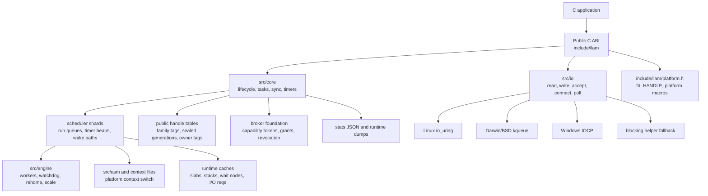

# Architecture

This page summarizes the implementation boundaries. The public contract remains
the headers under `include/llam/`.

## Scheduler

Each shard owns hot, normal, and inject queues, plus a timer heap and runtime
allocator caches. Task selection favors latency-sensitive work first, then
normal work, injected cross-shard work, and finally stealing.

## Context Switching

Supported platforms use assembly context switches that save the callee-saved
registers required by the platform ABI. Fallback contexts use the portable
context path where assembly support is not available.

## I/O Nodes

I/O nodes own platform backend state:

- Linux: io_uring rings and completion queues
- macOS/BSD: kqueue descriptors and EVFILT_USER wake paths
- Windows: IOCP ports and overlapped operation metadata

Requests carry owner-runtime and owner-shard information so completions wake
the correct task.

## Public Handles

Public handles are process-local misuse hardening. They reject stale, consumed,
wrong-family, and wrong-owner use before object storage is dereferenced. They
are not a sandbox against arbitrary same-process memory read/write.

## Broker Boundary

The broker foundation is the isolation direction for hostile or memory-unsafe
clients. The broker owns runtime state, MAC keys, descriptors/HANDLEs, and ring
sessions outside the untrusted address space. See [Security Model](../security.md).
