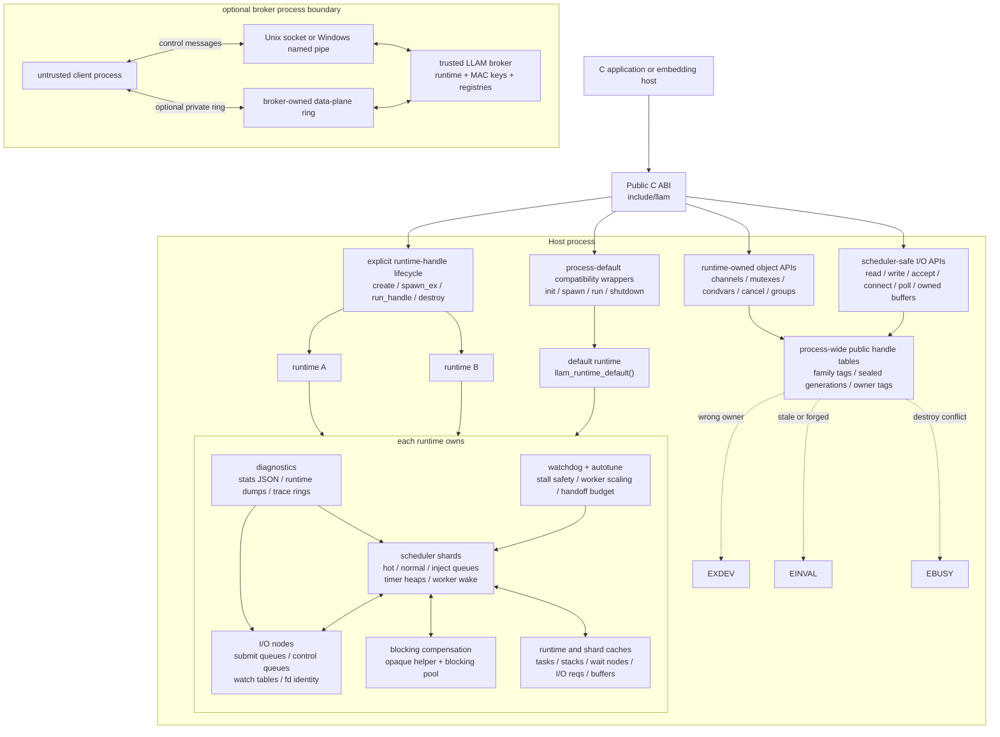
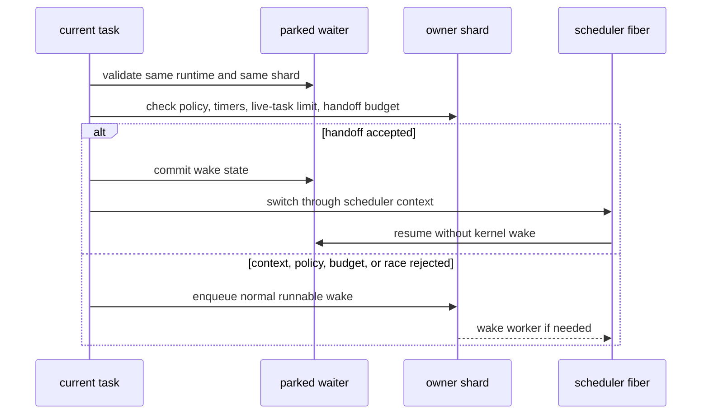

# Architecture

This page summarizes the implementation boundaries. The public contract remains
the headers under `include/llam/`; internal file names and layouts are not ABI.

## Boundary Map

LLAM is organized around explicit runtime handles. The legacy process-default
runtime is still available, but embedding hosts should use
`llam_runtime_create()`, `llam_runtime_spawn_ex()`,
`llam_runtime_run_handle()`, and `llam_runtime_destroy()`.

```mermaid
flowchart TB
    App["C application or embedding host"] --> API["Public C ABI\ninclude/llam"]
    API --> HandleAPI["explicit runtime-handle lifecycle\ncreate / spawn_ex / run_handle / destroy"]
    API --> DefaultAPI["process-default compatibility wrappers\ninit / spawn / run / shutdown"]
    API --> ObjectAPI["runtime-owned object APIs\nchannels / mutexes / condvars / cancel / groups"]
    API --> IOAPI["scheduler-safe I/O APIs\nread / write / accept / connect / poll / owned buffers"]

    subgraph Process["Host process"]
        HandleAPI --> RuntimeA["runtime A"]
        HandleAPI --> RuntimeB["runtime B"]
        DefaultAPI --> DefaultRuntime["default runtime\nllam_runtime_default()"]
        ObjectAPI --> Slots["process-wide public handle tables\nfamily tags / sealed generations / owner tags"]
        IOAPI --> Slots
        Slots -. "wrong owner" .-> EXDEV["EXDEV"]
        Slots -. "stale or forged" .-> EINVAL["EINVAL"]
        Slots -. "destroy conflict" .-> EBUSY["EBUSY"]

        subgraph RuntimeState["each runtime owns"]
            direction TB
            Shards["scheduler shards\nhot / normal / inject queues\ntimer heaps / worker wake"]
            Nodes["I/O nodes\nsubmit queues / control queues\nwatch tables / fd identity"]
            Blocking["blocking compensation\nopaque helper + blocking pool"]
            Caches["runtime and shard caches\ntasks / stacks / wait nodes / I/O reqs / buffers"]
            Watchdog["watchdog + autotune\nstall safety / worker scaling / handoff budget"]
            Debug["diagnostics\nstats JSON / runtime dumps / trace rings"]
            Shards <--> Nodes
            Shards <--> Blocking
            Shards <--> Caches
            Watchdog --> Shards
            Debug --> Shards
            Debug --> Nodes
        end

        RuntimeA --> RuntimeState
        RuntimeB --> RuntimeState
        DefaultRuntime --> RuntimeState
    end

    subgraph BrokerBoundary["optional broker process boundary"]
        Client["untrusted client process"] <-->|control messages| Transport["Unix socket or Windows named pipe"]
        Transport <--> Broker["trusted LLAM broker\nruntime + MAC keys + registries"]
        Client <-->|optional private ring| Ring["broker-owned data-plane ring"]
        Ring <--> Broker
    end
```

## Runtime Ownership

Every runtime-aware object is owner-tagged when it becomes public. Managed use
from another runtime fails with `EXDEV` before object storage is dereferenced.
Consumed or stale public handles fail with `EINVAL`; live public operations can
hold active pins that make destroy paths fail with `EBUSY` instead of racing
reclamation.

Explicit runtimes own scheduler shards, I/O nodes, active allocation caches,
blocking workers, live tasks, and backend wake handles. Process-wide reusable
storage is allowed only after the object is owner-poisoned; acquisition restamps
the current runtime before a new public handle is returned.

## Scheduler

LLAM is an N:M stackful scheduler. Each task is a `void (*)(void *)` function
with its own stack. OS worker threads run scheduler shards, and each shard owns:

- `hot_q` for latency-class work and completions.
- `norm_q` for ordinary runnable work.
- `inject_q` for cross-shard or host-injected work.
- a timer heap for sleeps and timed waits.
- per-shard caches and remote-free queues.
- a scheduler fiber context used to switch into managed tasks.

The scheduler loop drains injected work with a budget, fires timers, takes hot
work first, then normal work, then steals. If no work is ready, it waits on the
runtime wake handle for that platform.

Context switching is direct fiber switching through the platform context path:
hand-written assembly on supported architectures, with a portable fallback where
needed. Automatic preemption is request-based; watchdog/runtime policy can mark
a task, but a task switches only at LLAM boundaries such as yields, waits, I/O,
or safepoints.

## Wake Handoff Fusion

The normal wake path publishes a waiter as runnable, enqueues it on the owner
shard, and wakes a worker if needed. Wake Handoff Fusion is the faster same-shard
path used by latency-sensitive internal producers:

```mermaid
sequenceDiagram
    participant Producer as current task
    participant Waiter as parked waiter
    participant Shard as owner shard
    participant Scheduler as scheduler fiber

    Producer->>Waiter: validate same runtime and same shard
    Producer->>Shard: check policy, timers, live-task limit, handoff budget
    alt handoff accepted
        Producer->>Waiter: commit wake state
        Producer->>Scheduler: switch through scheduler context
        Scheduler->>Waiter: resume without kernel wake
    else context, policy, budget, or race rejected
        Producer->>Shard: enqueue normal runnable wake
        Shard-->>Scheduler: wake worker if needed
    end
```

The optimization is intentionally bounded. `direct_handoff_budget` limits long
handoff chains, `direct_handoff_live_limit` avoids applying it to oversized
fanout, and timer guards keep timer-heavy workloads from being starved unless
the runtime explicitly allows timer overlap. Every rejected path falls back to
the ordinary wake/enqueue path.

Metrics split yield handoff and wake handoff attempts, hits, policy failures,
budget failures, no-work failures, push failures, and wake races. These counters
feed diagnostics and the watchdog-attached autotune governor.

## Watchdog And Autotune

The 1ms watchdog is the safety loop. It checks safepoint progress, observes
queue pressure, scales dynamic workers when that experiment is enabled, pauses
and merges shards, and rehomes parked waiters or I/O ownership when a shard is
offlined.

Autotune is attached to that watchdog thread, not implemented as a managed LLAM
task. It rotates low-frequency metric windows without allocation, blocking, or
user callbacks. Modes are:

- `off`: no governor.
- `observe`: publish sampled windows and decisions without changing policy.
- `on`: adjust the direct handoff budget through guarded probes.
- `frozen`: keep the published state stable for diagnostics.

The current actuator is the handoff budget. It probes only when the sampled
handoff data suggests the current budget is constraining useful handoff work.
Probe decisions require enough attempts and hits before commit; insufficient
traffic extends the probe instead of forcing rollback. Hard push/race failures
or an optional wake-latency p99 guardrail back the budget off.

## I/O Nodes

Task-facing I/O looks blocking, but managed tasks park instead of pinning a
scheduler worker. Each call follows this shape:

1. Try a direct nonblocking path.
2. Cooperatively yield and retry when local work may produce readiness.
3. Submit to the runtime-owned backend if supported.
4. Fall back to a blocking helper when the backend cannot own the operation.

Backends are runtime-owned:

- Linux nodes own `io_uring` state, CQE processing, and fd identity tracking.
- macOS and BSD nodes own kqueue readiness, `EVFILT_USER` wakes, and shared
  watch state. Darwin-only Mach hints stay behind Darwin guards.
- Windows nodes own IOCP ports, Winsock overlapped operations, HANDLE
  `ReadFile`/`WriteFile`, and version-specific batching policy.

Requests carry owner-runtime and owner-shard information so completions wake the
correct task. Close helpers such as `llam_close()` and `llam_close_handle()`
mark the runtime-local descriptor boundary before the platform close.

## Blocking Compensation

`llam_enter_blocking()` and `llam_call_blocking_result()` keep foreign blocking
work from pinning scheduler progress. A shard-level opaque helper can take over
the local scheduler while the primary worker is in a blocking region. The
runtime-wide blocking pool handles explicit blocking jobs and reports completion
back to the owner runtime.

## Diagnostics

Runtime stats and dumps are architecture features, not add-ons. Dumps include
lifecycle state, stop flags, live tasks, active I/O waiters, blocking helper
state, node queues, shard wake ownership, wait ownership, cancellation state,
handoff counters, and autotune state. Rare shutdown, cancellation, lost wakeup,
select fanout, blocking helper, and I/O ownership failures should be reduced
into focused direct runtime tests.

## Broker Boundary

In-process public handles harden misuse, stale use, wrong-family casts, and
cross-runtime ownership mistakes. They are not a sandbox against code that can
read or corrupt the process memory.

The broker path is the isolation direction for hostile or memory-unsafe clients.
The broker owns runtime state, MAC keys, descriptors/HANDLE authority, grants,
revocation state, and private ring sessions outside the untrusted address space.
See [Security Model](../security.md).
