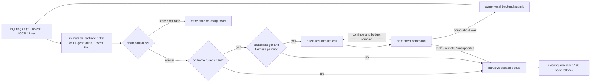

# LLAM Causal Completion Fusion

Status: research design

Date: 2026-07-26

Short name: LCCF

## Decision

LLAM should research a compiler-facing execution path named **Causal Completion
Fusion**.

The core rule is:

> A completion is not a wakeup. It is a generation-checked next program
> counter.

For a same-shard compiler continuation, LCCF fuses five normally separate
steps:

```text
OS completion
  -> wake object
  -> runnable queue
  -> scheduler selection
  -> coroutine/fiber resume
```

into:

```text
OS completion
  -> validate causal cell
  -> call compiler resume site
  -> consume next effect command
```

The callback runs only on the scheduler worker that owns the continuation and
its platform wait backend. It may continue directly for a bounded causal
budget. Remote completions, foreign producers, exhausted budgets, fairness
pressure, unsupported handles, and stackful tasks use explicit queue-based
fallbacks.

LCCF retains the language-neutral Executor-plane goal from LCWE, but discards
same-site sorting, pointer waves, capsule packing, and SIMD callbacks.

## Why LCWE Does Not Advance

The LCWE Phase 1 experiment proved that contiguous continuation state can be
vectorized, but falsified the required cost model:

- cohort formation alone ran at only `0.73x`–`0.75x` scalar throughput;
- pointer waves did not vectorize and every realistic pointer result was
  slower than scalar;
- capsule compute vectorized at width 4, but packing and scattering made
  capsules slower still;
- persistent AoSoA removed conversion cost but reached only
  `1.15x`–`1.18x`, below the `1.50x` throughput gate and the 30% CPU-reduction
  gate.

The successor therefore optimizes a cost that exists for every asynchronous
resumption: wake publication and scheduler re-entry. It does not require dense
same-site traffic, a vectorizable segment, or movable frame fields.

## Cost Hypothesis

A conventional language executor commonly pays some combination of:

```text
completion decode
+ task/waker lookup
+ generation or lifetime synchronization
+ reference-count or ownership traffic
+ runnable publication
+ queue synchronization
+ worker kick
+ scheduler selection
+ indirect task poll/resume
+ next operation submission
```

The LCCF same-shard path targets:

```text
completion decode
+ causal-cell compare/exchange
+ direct resume-site call
+ next operation submission
```

The hypothesis is not that a function call becomes free. It is that LLAM can
make the I/O/timer completion, continuation state transition, code dispatch,
and next effect submission one owner-local transaction.

This can be materially faster only when:

- the completion is already on the continuation's home shard;
- the callback is stackless, bounded, and safe to run on the scheduler worker;
- the backend ticket carries direct cell identity;
- no fairness, cancellation, migration, tracing, or foreign-runtime boundary
  requires queueing;
- the next effect can reuse owner-local storage without allocation.

All other cases must have a measured, predictable fallback.

## Product Position

LCCF is intended to make LLAM a runtime backend in the same architectural
layer where LLVM is a code-generation backend:

```text
language frontend
  -> compiler-generated async/effect segments
  -> language-neutral LLAM Executor ABI
  -> LLAM scheduling, waits, cancellation, timers, I/O, and diagnostics
  -> io_uring / kqueue / IOCP
```

The first consumers can be:

- hand-written C state machines;
- compiler-generated C or LLVM coroutine adapters;
- another language runtime delegating its async I/O execution;
- a C++ sender/receiver adapter;
- a Rust local executor adapter that does not expose LLAM internals as a Rust
  ABI.

The existing stackful C task API remains supported and unchanged.

## Prior Art And Differentiation

Individual mechanisms have strong prior art:

- Go's integrated netpoller returns ready goroutines, and the Go scheduler can
  select work discovered by netpoll.
- Rust `RawWaker` is a data pointer plus executor-defined wake vtable.
- libuv binds an event loop to one thread and fires I/O callbacks after polling.
- Seastar uses per-shard reactors, futures, and ready-continuation queues.
- Swift executors accept jobs and can avoid an executor hop when isolation
  permits.
- P2300 sender/receiver permits synchronous inline completion.
- Linux `IORING_SETUP_SINGLE_ISSUER` and
  `IORING_SETUP_DEFER_TASKRUN` explicitly optimize a per-thread event-loop
  ownership model.

LCCF does not claim that direct callbacks, reactor-per-core, state machines, or
inline completion are individually novel. Its differentiated contract is:

```text
cross-language size-prefixed C ABI
+ compiler-known resume sites
+ LLAM-owned generation/cancellation cell
+ same-thread OS completion and next-effect submission
+ bounded direct continuation threading
+ stackful C coexistence
+ io_uring, kqueue, and IOCP implementations
+ queue fallback with observable reasons
```

The reviewed systems expose important subsets:

- Go returns goroutines to its language runtime scheduler.
- Rust standardizes wake customization but not a platform I/O executor.
- libuv invokes callbacks but does not define a compiler continuation or
  exactly-once effect-state ABI.
- Seastar is a C++ framework whose documented scheduler maintains ready
  continuation queues.
- P2300 is a C++ execution model, not a stable C runtime ABI or platform wait
  implementation.

The complete contract is a credible LLAM position. It is not an uncopyability
or patent-novelty claim. “Only LLAM” means LLAM can compose this path with its
existing stackful plane, per-shard experimental rings, generation-protected
wait ownership, direct-handoff metrics, and watchdog rollback without first
building a new runtime from scratch.

Primary references:

- [Go runtime network poller](https://go.dev/src/runtime/netpoll.go)
- [Go runnable selection](https://go.dev/src/runtime/proc.go)
- [Rust `RawWaker`](https://doc.rust-lang.org/std/task/struct.RawWaker.html)
- [libuv design overview](https://docs.libuv.org/en/v1.x/design.html)
- [Seastar continuation scheduling](https://docs.seastar.io/master/split/26.html)
- [Swift custom actor executors](https://github.com/swiftlang/swift-evolution/blob/main/proposals/0392-custom-actor-executors.md)
- [P2300 `std::execution`](https://www.open-std.org/jtc1/sc22/wg21/docs/papers/2024/p2300r9.html)
- [`io_uring_setup(2)`](https://man7.org/linux/man-pages/man2/io_uring_setup.2.html)

## Architecture



### Two Execution Planes

The **Fiber Task plane** remains the current `llam_task_t` stackful N:M
scheduler. It keeps:

- task stacks and context switching;
- hot, normal, and inject queues;
- channels, joins, groups, task-local state, and blocking helpers;
- existing public task handles and ABI 2.x;
- current direct task handoff and watchdog policies.

The **Effect Continuation plane** uses:

- a language-owned nonmoving frame;
- an LLAM-owned executor instance;
- one reusable causal cell;
- immutable backend tickets for outstanding wait generations;
- compiler- or adapter-provided scalar resume-site callbacks;
- event input and next-effect command output.

The two planes share runtime lifetime, stop, cancellation, worker capacity,
backend capabilities, fairness accounting, and diagnostics. They do not share
a public task object or require a fiber context switch.

### Fused Shard

A fused shard is a scheduler shard whose worker is also the single owner and
poller of one Executor-plane platform backend.

The initial production experiment must not move existing stackful I/O onto that
backend. It creates an Executor-only backend so the old path remains a control
and rollback boundary.

The fused worker loop conceptually becomes:

```text
drain remote executor commands
reap a bounded completion batch
run direct continuation budget
fire timers
run existing stackful queues
submit accumulated effects
poll backend or shard wake source
```

Ordering is adaptive, but every source has a hard budget. A continuation
completion cannot monopolize a worker merely because it keeps producing
immediate work.

## Causal Cell

The causal cell is the exactly-once state shared by completion, timeout,
cancellation, runtime stop, and direct execution.

Conceptually it contains:

```text
state + generation
module and instance identity
home shard and scheduling class
next resume-site index
event result cell
intrusive escape-queue link
backend-reference count
diagnostic counters
```

The target is one cache line for the common scheduling fields plus a separate
event/command area. Phase 0 must measure 64-, 96-, and 128-byte layouts before
any layout is frozen.

The public ABI never exposes the atomic word or intrusive link. Language
adapters receive only opaque instance handles, event structures, and command
structures.

### State Machine

One generation follows:

```text
IDLE(g)
  -> ARMED(g)
  -> CLAIMED(g)
  -> RUNNING(g)
  -> ARMED(g+1) or QUEUED(g) or TERMINAL(g)
```

Competing sources perform:

```text
ARMED(g) -> CLAIMED(g)
```

with one compare/exchange. The winner publishes the event. Losers retire their
backend ownership without executing or queueing the instance.

`RUNNING(g)` is owned only by the home scheduler worker. No callback may be
entered twice for one instance. A direct callback can arm generation `g+1`
only after its command has been validated and the current winning ticket is
terminal.

### Backend Tickets

A backend ticket is immutable while an OS backend may still return it. It
contains:

- causal-cell pointer or sealed internal handle;
- captured generation;
- expected event kind;
- backend slot identity;
- owner runtime and node/shard identity;
- backend-specific request storage or pointer.

The ticket, not the reusable cell, is carried in `user_data`, `udata`, or
`OVERLAPPED` ownership.

An instance embeds enough tickets for the common timed-I/O race. A losing
cancellation or timeout ticket cannot be reused until its backend terminal
notification retires it. Exceptional overlap uses a runtime pool or delays a
new arm; it never reuses an OS-visible address early.

Frame destruction waits for:

```text
state == TERMINAL
and callback_active == false
and backend_refs == 0
and external_refs == 0
and escape_queue_owned == false
```

## Resume-Site Contract

The scalar callback shape is conceptually:

```c
int resume_one(void *module_context,
               void *frame,
               const llam_executor_event_t *event,
               llam_executor_command_t *command);
```

The callback executes one compiler-defined segment and returns exactly one
command. Initial command kinds are:

- `CONTINUE`: execute another site immediately if budget permits;
- `WAIT_IO`: arm one read, write, accept, connect, or poll effect;
- `WAIT_TIMER`: arm a monotonic deadline;
- `YIELD`: enter the local escape queue;
- `COMPLETE`: terminate successfully;
- `FAIL`: terminate with a language- or adapter-defined error.

Cancellation and runtime stop arrive as event kinds. A callback may convert
them into cleanup effects, but the runtime can force terminal teardown after a
bounded cleanup budget.

### Callback Restrictions

A resume callback:

- runs only on its home scheduler worker;
- receives no LLAM queue or backend lock;
- must not block the OS thread;
- must not unwind an exception or language panic through C;
- must not move or free its frame;
- may call only ABI operations explicitly marked callback-safe;
- must initialize every required command field and keep reserved fields zero;
- must reach a command boundary within the declared segment budget;
- must tolerate cancellation and runtime-stop events exactly once.

Debug-safe mode times every callback and poisons command storage before entry.
Repeated invalid commands, blocking, stack overflow, or budget violations fail
the instance and can disable direct mode for its module.

### Frame And Language Runtime Integration

The language owns frame allocation and layout. The frame is nonmoving while an
instance is live. The module descriptor provides:

- resume-site table;
- frame-drop callback;
- optional GC root enumeration callback;
- optional safepoint callback;
- maximum declared callback stack use;
- module flags and diagnostic names.

Moving-GC integration starts with pinned frames or stable handles. Precise
relocation handshakes are out of scope until the scalar execution and lifetime
model pass.

## Executor ABI

LCCF keeps the separate size-prefixed query boundary proposed by LCWE:

```text
llam_executor_query(requested_version, out_api, out_size)
```

The experimental ABI contains:

- module registration and unregistration;
- instance creation, start, cancel, and release;
- one-shot external wake;
- callback-safe buffer and diagnostic operations;
- instance and module statistics;
- capability discovery for fused and queued modes.

Every structure starts with:

```text
struct_size
abi_version
flags
reserved-zero fields
```

LLAM copies module and site descriptors. Module unregistration returns `EBUSY`
while a callback, instance, backend ticket, queue entry, or external reference
can still reach module code.

The first ABI is experimental and not installed or versioned as a stable LLAM
release until the cross-platform prototype passes.

## Direct Execution Policy

Direct execution is allowed only when all of the following hold:

- the current thread is the instance's home fused-shard worker;
- the cell winner is the expected generation;
- the module remains registered and direct-enabled;
- no runtime stop policy requires queue-based cleanup;
- no older backend ownership prevents a safe new arm;
- the callback and causal budgets remain;
- timer, stackful hot work, and foreign work are within latency guardrails;
- tracing or diagnostics do not require a slower audited path;
- the shard is not migrating, paused, or under opaque-block compensation.

Otherwise the cell enters an allocation-free intrusive escape queue. Queueing
is a first-class mode, not an error.

### Causal Budget

Each fused shard maintains:

- maximum directly chained callbacks;
- maximum direct nanoseconds before rechecking other sources;
- maximum same-instance consecutive segments;
- maximum completion batch before stackful work;
- per-class latency budget;
- direct-hit, escape-reason, and budget-exhaustion metrics.

The initial values are conservative and profile-controlled. The watchdog may
observe them in the first prototype, but it must not tune them until fixed
budgets pass deterministic fairness tests.

### Reentrancy

Direct execution is not arbitrary recursive callback dispatch.

`CONTINUE` is implemented as an owner loop, not C recursion. A completion
produced synchronously while a callback is active is appended to a small local
ready list and handled after the callback returns. Cross-instance direct
threading therefore has bounded stack depth of one callback.

## Platform Mapping

### Linux

The intended fast path is one Executor ring per fused shard, owned by the shard
worker, with capability-gated use of:

- `IORING_SETUP_SINGLE_ISSUER`;
- `IORING_SETUP_DEFER_TASKRUN`;
- `IORING_SETUP_COOP_TASKRUN`;
- `IORING_SETUP_TASKRUN_FLAG`;
- registered files and buffers where workload evidence justifies them;
- multishot operations only when lifetime and fairness gates pass.

The owner worker creates or enables the ring so the single-issuer contract is
real. Foreign submissions first enter the shard's command ring; they never
write the SQ directly.

Older kernels, unsupported operations, and ring setup failures use the existing
I/O-node or blocking-helper path.

### Darwin And BSD

Each fused shard owns an Executor kqueue. The shard wake source and backend
events are observed in one `kevent` wait. `EVFILT_USER` or the existing
platform wake primitive interrupts the wait for foreign commands.

Readiness callbacks still perform the required nonblocking operation. The
causal cell is claimed only when an event can be published with the same
semantics as the scalar reference.

BSD capability differences stay behind the existing kqueue backend guards.

### Windows

Each fused shard owns an Executor completion port polled with
`GetQueuedCompletionStatusEx`. `OVERLAPPED` storage remains inside an immutable
backend ticket. Handles associated with another port or operations that cannot
safely honor shard affinity use the existing IOCP-node fallback.

Synchronous completion and skip-completion-on-success require the same exactly
once claim as asynchronous packets. No user callback runs while an association
or ticket-pool lock is held.

## Stackful Coexistence

LCCF does not make stackful tasks second-class.

The scheduler checks stackful hot work after each direct completion batch and
before blocking. A profile can reserve a percentage of dispatch opportunities
for each plane. Direct continuation chains are cut when:

- a latency-class stackful task is ready;
- a timer is due;
- normal work exceeds its wait budget;
- the watchdog requests a safepoint;
- the direct callback budget expires.

Existing stackful I/O remains on existing nodes until an independent experiment
proves that fused backend ownership helps it without ABI or regression risk.

## Cancellation, Timeout, And Stop

I/O completion, timeout, explicit cancellation, external wake, and runtime stop
race on the same `(state, generation)` claim.

The winner:

1. owns event publication;
2. owns direct execution or escape-queue admission;
3. initiates cancellation of losing backend tickets where necessary.

Losers:

1. never overwrite the event;
2. never call module code;
3. retire only their own backend reference;
4. may finish asynchronously after the instance has logically advanced.

Runtime destruction closes new instance creation, stops new arms, resolves live
cells, drains backend tickets and queued entries, invokes frame-drop callbacks,
then releases module pins.

## Security And Fault Containment

The Executor ABI is a trusted in-process extension boundary, like a compiler
runtime ABI. It is not a sandbox.

Required hardening includes:

- sealed internal handles or generation-tagged slots for public instances;
- size and reserved-field validation on every ABI structure;
- checked enum, pointer, buffer, offset, and deadline values;
- module lifetime pins around every callback;
- exactly-once frame destruction;
- backend ticket quarantine until terminal completion;
- callback stack and duration diagnostics;
- no callback under internal locks;
- fail-closed generation mismatch and ownership mismatch;
- explicit rejection of cross-runtime instance and buffer use;
- broker isolation for hostile or memory-unsafe clients.

Direct mode is disabled for a module after repeated contract violations. The
queued audited path remains available for diagnosis when safe.

## Observability

Per runtime, shard, module, and site, expose:

- completions observed, claimed, stale, and lost;
- direct callbacks and chained segments;
- escape count by reason;
- callback wall and CPU histograms;
- direct-to-queued transition latency;
- backend ticket pool use and fallback allocation;
- same-shard and remote completion counts;
- callback command kinds;
- cancellation and timeout winner counts;
- maximum direct streak;
- stackful latency while direct work is active;
- ring/CQ/SQ or kqueue/IOCP batch depth.

Statistics collection must be sampled or profile-gated so the fast path does
not pay for production-disabled histograms.

## Phase 0 Standalone Cost Model

No production runtime or public header changes before a standalone model
passes.

### Compared Modes

1. **waker queue baseline**
   - generation claim;
   - task/waker identity load;
   - ready publication into a bounded queue;
   - dequeue and indirect resume call;
   - next-command validation.
2. **causal-cell queue**
   - LCCF cell and ticket representation;
   - intrusive local queue;
   - dequeue and scalar resume.
3. **fused causal cell**
   - completion claim;
   - direct scalar resume;
   - next-command validation;
   - no ready queue.
4. **budgeted fused chain**
   - repeated `CONTINUE` or synthetic completion segments;
   - forced escape at the exact configured budget.
5. **remote waker queue baseline**
   - foreign-producer publication into a bounded MPSC queue;
   - owner drain, task/waker lookup, and indirect resume.
6. **remote causal cell**
   - cross-shard bounded MPSC admission;
   - owner drain and direct cell-to-site resume.

No mode may allocate in measured rounds.

### Fixed Workloads

- `completion_io_pipeline`: result check, protocol state update, buffer cursor,
  and next read/write command;
- `completion_rpc_state`: branch-heavy RPC result and retry/route state;
- `completion_timer_cancel`: generation, timeout, cancellation, and cleanup
  branches;
- `completion_mixed_fairness`: short continuations mixed with queued stackful
  placeholders and due timers.

Frame footprints of 64, 128, and 256 bytes are included. One-site and mixed-site
distributions are diagnostic dimensions, not SIMD cohorts.

### Measurement Repair

LCWE showed that independent short-lived processes are too sensitive to an
interactive macOS host. Phase 0 uses paired measurements:

- one process creates equivalent baseline and candidate states;
- ABBA ordering alternates baseline/candidate execution;
- each mode runs for at least 250 ms of measured time per process;
- nine fresh processes form one cell;
- speedup and CPU ratios are calculated within a process before aggregation;
- paired-ratio spread is `maximum / minimum` across the nine process-local
  ratios for each gate-driving cell;
- checksums and final states must match after every measured block;
- raw absolute times and paired ratios are both retained;
- Linux records CPU affinity and uses a fixed owner CPU when available;
- macOS records QoS and active processor topology without changing user apps.

An integrity failure remains `INCONCLUSIVE`; no outlier is silently removed.

### Phase 0 Gates

A `PROMISING` verdict requires:

- all three fixed functional workloads reach at least `1.25x` paired wall
  speedup and at most `0.80x` paired CPU ns/op against the waker-queue
  baseline;
- at least two workloads reach `1.50x` paired wall speedup;
- causal-cell queue throughput is no worse than `0.95x` the waker baseline;
- remote-cell throughput is no worse than `0.95x` the corresponding remote
  baseline;
- budgeted mixed-fairness p99 degradation is at most 10%;
- every checksum, generation race, and forced-escape test passes;
- paired-ratio spread is at most `1.10x`.

`NARROW` means the functional gates pass only for a clearly delimited workload
class and the ABI can expose an opt-in site flag without burdening other sites.

`REJECT` means the measured benefit cannot repay the causal-cell and command
contract, or fairness requires queueing so often that fusion has no useful
domain.

`INCONCLUSIVE` is reserved for integrity, reproducibility, or environment
failure.

## Production Research Phases

Only a `PROMISING` or well-scoped `NARROW` Phase 0 result advances.

1. **Standalone paired model**
   - representation, lifecycle, command validation, direct and queued costs.
2. **Internal scalar instance**
   - module and instance lifetime with a synthetic completion source;
   - no public installation or platform backend changes.
3. **Linux fused ring**
   - one shard, one ring, one manual C adapter;
   - existing I/O node remains the fallback and control.
4. **Darwin/BSD and Windows fused waits**
   - semantic parity and explicit capability fallback.
5. **Compiler proof**
   - one LLVM coroutine/effect lowering and one foreign-runtime adapter.
6. **Mixed-plane validation**
   - real network and timer I/O, stackful load, cancellation races, p99
     latency, shutdown, sanitizer, and fault injection.
7. **Experimental ABI**
   - opt-in query table only after all primary platforms pass.

Each phase has a stop point and rollback path.

## Falsification Conditions

Stop or narrow LCCF if any of these hold:

- the standalone direct path misses the Phase 0 gates;
- compiler segments are too long to preserve stackful or timer latency;
- direct mode escapes often enough that queueing remains the dominant cost;
- one backend ticket per wait cannot be made lifetime-safe without hot
  allocation or global synchronization;
- per-shard backend resource use is unacceptable at realistic core counts;
- Windows handle association or BSD kqueue semantics require a materially
  different public contract;
- moving-GC integration requires exposing unstable internal pointers;
- a foreign runtime cannot implement the callback contract without duplicating
  its scheduler;
- existing stackful benchmark geometric mean regresses by more than 3%;
- balanced-mode p99 latency regresses by more than 10%.

## Research Thesis

LCWE asked whether LLAM could make many resumptions cheaper by executing them
together. The answer was no for the tested generic workloads.

LCCF asks a more fundamental question:

> Can LLAM erase the boundary between “the operation completed” and “the
> compiled program continued,” while keeping fairness, cancellation, lifetime,
> portability, and C interoperability explicit?

If the answer is yes, the result is not merely another coroutine scheduler. It
is a language-neutral effect execution backend whose fast path is an
owner-local continuation of the OS completion itself.
