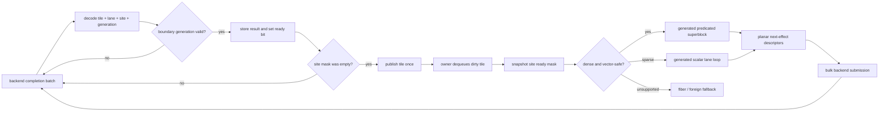

# LLAM Site-Resident Effect Machine

Status: research design

Date: 2026-07-26

Short name: SREM

## Decision

LLAM should research a compiler/runtime execution contract named the
**Site-Resident Effect Machine**.

Its core rule is:

> Do not schedule continuation objects. Admit completion bits into
> compiler-shaped effect tiles and execute the tile's generated superblock.

An **effect tile** is a fixed-width group of independent invocations of the
same compiler-lowered async module. Its hot suspended state is permanently
stored in split field planes, and each suspension site has a ready-lane mask.
A backend completion identifies a tile, lane, site, and generation. The owner
records the result and sets the corresponding lane bit. A tile becomes
runnable only on the empty-to-nonempty transition, so multiple completions
coalesce into one scheduler publication without waiting for an artificial
batching timer.

A compiler-generated **effect superblock** consumes the ready mask, executes
the full scalar segment from one real suspension point to the next for every
active lane, and emits the next platform operations in field planes. Dense
tiles use predicated SIMD code. Sparse, divergent, address-exposed, foreign,
and fairness-sensitive tiles use a scalar lane loop over the same state.

The existing stackful C runtime remains the general fallback. SREM is a
specialized Executor plane for high-throughput homogeneous async pipelines.

## Why This Follows From The Negative Results

LCWE and LCCF rejected two more conservative optimization boundaries:

- LCWE proved that persistent split state can vectorize, but generic cohort
  formation, pointer traversal, packing, and scattering consumed the gain.
  Even the conversion-free AoSoA upper bound reached only `1.15x` to `1.18x`
  median throughput.
- LCCF proved that replacing a waker with a richer per-task completion cell is
  substantially worse. Removing one queue hop did not repay per-completion
  object lookup, generation arbitration, callback dispatch, and command
  validation. Only bounded direct chaining showed a small median gain.

SREM therefore moves the boundary across both failed costs:

```text
conventional compiler executor
  = per-invocation frame
  + per-completion runnable object
  + per-resume indirect dispatch
  + scalar state transition
  + per-invocation command materialization

SREM
  = compiler-resident field planes
  + per-site ready mask
  + one dirty-tile publication
  + generated predicated superblock
  + planar command emission
```

There is no runtime pack, scatter, site sort, callback lookup, or replacement
completion object on the dense path.

## Exact Performance Hypothesis

The candidate can be category-defining only when all three savings compose:

1. **Admission coalescing:** `N` already-reaped completions touching one tile
   require one runnable publication rather than `N` waker publications.
2. **Permanent hot layout:** the compiler places live-across-suspend scalar
   fields directly in contiguous planes, so no candidate conversion cost is
   hidden outside the measurement.
3. **Cross-invocation widening:** one generated site superblock processes
   independent active invocations with predicated vector operations and
   planar next-operation stores.

The target is at least `1.50x` wall throughput and at most `0.70x` CPU time
against a conventional compiler-generated waker/coroutine executor on two
realistic homogeneous pipelines. Sparse traffic must cross over to scalar
execution without a material regression.

SREM is rejected as LLAM's defining technology if it produces only the
`1.15x` class of gain already observed in LCWE.

## Execution Model



### Tile Identity

A public or backend ticket never contains a raw language frame pointer. The
initial private ticket shape is logically:

```c
typedef struct llam_effect_ticket {
    uint32_t tile_index;
    uint16_t lane;
    uint16_t site;
    uint32_t generation;
    uint32_t operation;
} llam_effect_ticket_t;
```

Platform encodings may pack this identity into `io_uring` `user_data`, a
kqueue `udata` record, or an IOCP overlapped wrapper. The exact bit allocation
is backend-private. A checked table lookup maps `tile_index` to an executor
module and tile.

Generation validation happens once when an external event crosses into the
owner site. Owner-local superblock transitions do not repeatedly claim a
per-lane atomic state word. Cancellation increments the lane generation and
clears its admission bits before storage is reused.

### Tile Storage

A module declares its tile width and field schema at compile time. A logical
tile contains:

```text
header
  module descriptor
  tile generation
  queued/running state
  per-site ready masks
  external-arrival mask
  fallback mask

hot planes
  generation[lane]
  program_state[lane]
  event_kind[lane]
  event_result[lane]
  language live field 0[lane]
  language live field 1[lane]
  ...

next-effect planes
  operation[lane]
  handle[lane]
  buffer[lane]
  length[lane]
  deadline[lane]

sidecar references
  cold or address-exposed state[lane]
```

Fields with observable addresses, destructors, pinning requirements, dynamic
size, FFI visibility, or nontrivial aliasing remain in a scalar sidecar. The
compiler marks any site that touches them as scalar-only unless it can prove a
legal vector access.

The research width set is `8`, `16`, and `32` lanes. A production compiler may
emit several width variants and select one from the target's vector width,
cache model, and measured occupancy.

### Admission Protocol

The owner-local backend path is non-atomic:

1. validate the ticket generation;
2. store the completion payload into the lane's event planes;
3. set the lane in the site's ready mask;
4. if the tile was not already dirty or running, append its index to the
   owner's dirty-tile queue.

Foreign producers use release stores for payloads and an atomic ready-mask
OR. Only the producer that observes the empty-to-nonempty transition publishes
the tile. The owner uses an acquire snapshot and a drain/recheck protocol so a
completion racing the superblock cannot be lost.

Duplicate and stale tickets are dropped before touching a ready bit. A lane
cannot be admitted to two mutually exclusive sites for one generation.

### Generated Superblock

One superblock corresponds to one real suspension site. It executes exactly
the scalar program segment a conventional coroutine resume function would
execute before reaching its next actual suspension, return, or escape.

The compiler produces:

- a scalar lane entry for arbitrary masks and debugging;
- a predicated vector entry for dense masks;
- live-field plane metadata;
- next-effect descriptor metadata;
- scalar escape sites;
- a canonical-state projector used by differential tests and diagnostics.

The vector entry is not an indirect callback per lane. It is selected once per
site and tile:

```text
mask = snapshot(site.ready)
load field planes
execute predicated program region
write field planes
partition lanes by next effect
emit descriptor planes
return {resubmit masks, complete mask, escape mask}
```

This is cross-invocation vectorization, not concurrent execution of one
invocation. Language memory-model effects remain ordered per lane.

### Adaptive Scalar Crossover

SREM must not delay a completion merely to fill a tile. The owner processes
the completion batch already returned by the platform and immediately
dispatches dirty tiles.

For every site, a policy table selects:

- vector entry when active lanes and predicted useful work repay masked
  execution;
- scalar lane loop below the learned density threshold;
- ordinary Executor/fiber fallback for foreign calls, blocking work, tracing
  modes that require per-step hooks, or unsupported effects.

The Phase 0 policy uses fixed predeclared thresholds. Production may later use
bounded telemetry, but an autotuner is not part of the initial hypothesis.

## Compiler And C Contracts

### Compiler Backend

A compiler lowering pass identifies eligible async regions after escape and
alias analysis. It converts live-across-suspend fields into the module's plane
schema and emits scalar and vector site functions.

LLVM is a natural first integration point because its async coroutine lowering
already leaves control-flow transfer to the frontend and splits an async
coroutine into resume functions. SREM requires an earlier, language-aware pass
to form a cross-invocation vector region before ordinary coroutine frames are
fixed.

The compiler must preserve:

- per-lane sequencing and exception semantics;
- cancellation cleanup and destructors;
- safe points and bounded vector work;
- debug mapping from module/site/lane to source suspension points;
- a scalar equivalent for every vectorized site.

### C Consumer

C remains a first-class consumer. A C module can register generated or
hand-written descriptors and field planes:

```text
llam_effect_module_register(runtime, descriptor, &module)
llam_effect_tile_acquire(module, &tile)
llam_effect_lane_start(tile, lane, initial_state)
llam_effect_complete(ticket, result)
```

The public form is a size-prefixed C ABI. C callers do not need LLVM coroutine
intrinsics, and no language-specific object crosses the ABI.

### Other Languages

A language runtime may choose among three levels:

1. submit ordinary stackful or callback work to existing LLAM;
2. adapt stackless scalar continuations to the Executor plane;
3. lower selected homogeneous async regions directly to SREM modules.

Level 3 is the performance contract. Levels 1 and 2 preserve portability and
make adoption incremental.

## Correctness And Fairness

The protocol must make the following invariants mechanically testable:

- one winning completion per lane generation;
- no lost completion across producer/owner drain races;
- no lane executes after cancellation or storage reuse;
- scalar and vector entries produce field-for-field canonical equality;
- no allocation in admission, dispatch, or effect submission;
- a tile has at most one dirty-queue presence;
- a generated superblock has a strict instruction/effect budget;
- due timers, stackful tasks, and sparse tiles have a bounded service gap;
- fallback preserves the same cancellation and ownership semantics.

Vector execution is cooperative. The initial budget is one site superblock per
tile before the worker rechecks timers and other run queues. A later production
prototype may process another site from the same tile only when the fairness
budget permits.

## Prior Art And Differentiation

SREM composes established mechanisms rather than claiming that any component
is individually novel:

- LLVM async coroutine lowering splits a coroutine into resume functions and
  leaves control-flow transfer to the frontend.
- LLVM VPlan models predicated vector candidates and active-lane masks.
- ISPC and GPU SIMT execute a program gang under an active mask.
- FD.io VPP dispatches vectors through graph nodes to amortize instruction and
  call overhead.
- IREE explicitly discusses using coroutines for batching and cooperative
  scheduling.
- `io_uring` exposes batched submission/completion rings and a 64-bit
  completion identity.
- Task-vectorization research shows that schedulers can expose SIMD work from
  independent tasks.

SREM's proposed LLAM-specific contract is the complete combination:

```text
language-neutral size-prefixed C ABI
+ compiler-shaped persistent suspended-state planes
+ completion identity that addresses tile/site/lane/generation
+ empty-to-nonempty ready-mask coalescing
+ scalar and predicated superblocks generated from one async region
+ planar platform-effect emission
+ stackful and foreign escape on the same runtime
+ cross-platform io_uring, kqueue, and IOCP ownership
```

VPP vectorizes packet graph nodes but is not a general compiler async backend.
ISPC and SIMT do not own timers, cancellation, I/O completion identity, or
language coroutine lifetime. Ordinary coroutine executors retain an object per
invocation and resume it independently. IREE's roadmap permits batching but
does not define this cross-language persistent field-plane ABI.

This is a credible differentiated product position, not an uncopyability or
patent-novelty claim.

Primary references:

- [LLVM coroutine lowering](https://llvm.org/docs/Coroutines.html)
- [LLVM Vectorization Plan](https://llvm.org/docs/VectorizationPlan.html)
- [Intel ISPC execution model](https://ispc.github.io/ispc.html)
- [FD.io VPP software architecture](https://docs.fd.io/vpp/25.10/developer/corearchitecture/softwarearchitecture.html)
- [FD.io VPP graph dispatcher](https://docs.fd.io/vpp/23.02/developer/corearchitecture/vlib.html)
- [IREE design roadmap](https://iree.dev/developers/design-docs/design-roadmap/)
- [Efficient I/O with `io_uring`](https://kernel.dk/io_uring.pdf)
- [Extracting SIMD Parallelism from Recursive Task-Parallel Programs](https://doi.org/10.1145/3365663)

## Phase 0 Falsification Gate

The first implementation is a standalone C11 cost model. It must compare the
same deterministic async programs under:

- conventional AoS frames, generation-checked wakers, runnable queue,
  indirect resume site, and per-frame next-effect descriptors;
- tile scalar control with permanent planes and mask coalescing;
- tile vector control;
- complete adaptive SREM with scalar crossover and planar effect emission.

The matrix includes:

- two homogeneous server pipelines and one divergence/cancellation negative
  control;
- tile widths `8`, `16`, and `32`;
- completion occupancy `1`, `25%`, `50%`, and `100%`;
- one and eight suspension sites;
- hot frame footprints `64`, `128`, and `256` bytes;
- owner-local and two-producer remote admission;
- `0%`, `12.5%`, and `50%` divergent lanes.

Every pair uses identical events, generations, logical work, and measured
rounds. The candidate receives no hidden pre-grouped input: completion
admission and dirty-tile publication are inside the measured region.

A `CATEGORY` result requires one tile width to satisfy all of:

- both homogeneous pipelines achieve worst-case wall speedup `>= 1.50x` and
  CPU ratio `<= 0.70x` for occupancy `>= 50%`, all frame footprints, both site
  counts, and divergence `<= 12.5%`;
- adaptive SREM remains `>= 0.95x` baseline throughput at one-lane occupancy
  and at `50%` divergence;
- remote admission remains `>= 0.90x` its conventional remote baseline;
- p99 service-gap degradation is `<= 10%`;
- canonical equality, cancellation, stale-ticket, queue-identity, forced
  escape, and zero-hot-allocation checks pass;
- every gate-driving process-local ratio spread is `<= 1.10x`.

`SPECIALIZED` requires both homogeneous pipelines to pass the category gates
for one explicitly named occupancy/site envelope while sparse, remote,
fairness, correctness, and stability controls still pass.

Use `REJECT` for a stable cost-model failure and `INCONCLUSIVE` for incomplete,
incorrect, unsupported, duration-deficient, allocation-bearing, or unstable
evidence. Do not relax the gate after seeing results.

## Production Boundary

Even `CATEGORY` authorizes only a Linux owner-local synthetic-completion
prototype. It does not authorize a public ABI or replacement of the stackful
runtime.

Production phases would proceed in this order:

1. internal module/tile lifetime and scalar entries;
2. Linux `io_uring` ticket admission with generated C modules;
3. compiler-produced predicated entries and vectorization audit;
4. cancellation, tracing, diagnostics, and watchdog rollback;
5. kqueue and IOCP backends;
6. experimental size-prefixed C Executor ABI;
7. one external compiler/runtime integration.

Any phase that cannot preserve scalar equivalence, bounded latency, and cheap
sparse fallback stops the architecture.
