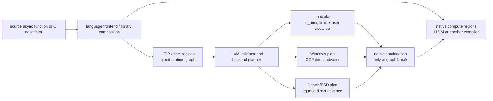

# LLAM Effect IR

Status: research design

Date: 2026-07-27

Short name: LEIR

## Decision

LLAM should research a language-neutral runtime intermediate representation
named **LLAM Effect IR**.

Its core rule is:

> Do not resume language code when the next action is already a runtime effect.
> Advance the effect program inside the backend and resume native code only at
> an observable graph break.

A compiler or C producer describes a reusable, immutable **effect program**.
Each submission creates a compact mutable **effect instance** containing
bindings, result slots, a graph cursor, cancellation state, and one terminal
completion target. The platform backend advances that instance across
consecutive I/O, timer, and later concurrency effects without scheduling a
language task or invoking a language continuation after every operation.

On Linux, the planner lowers eligible static segments to linked `io_uring`
requests. On Windows and kqueue platforms, where the kernel does not provide
equivalent request chaining, the I/O completion loop advances the graph and
submits its next operation before returning to the language scheduler.

LEIR is not:

- a new source language;
- a general bytecode VM;
- a replacement for LLVM IR or native computation;
- a requirement to turn all C tasks into stackless tasks;
- a promise that every graph segment can be offloaded into a kernel.

Native computation stays in compiler-produced machine code. The existing
stackful LLAM executor remains the universal fallback. LEIR is the lower,
portable runtime-effect boundary that can serve stackful C, callbacks,
coroutines, sender/receiver implementations, and language runtimes.

## Why This Boundary Follows From The Evidence

Three experiments rejected continuation-side optimization boundaries:

- LCWE showed that generic continuation batching and SIMD widening lose to
  cohort discovery, pointer traversal, packing, grouping, and scatter.
  Conversion-free persistent layout reached only a small upper-bound gain.
- LCCF showed that replacing a waker with a richer completion cell adds more
  state arbitration and dispatch than it removes. Direct callback chaining
  was the only positive component and reached only about a `1.06x` median.
- SREM reduced ready publications and successfully vectorized dense tiles,
  yet permanent planar state and tile execution remained much more expensive
  than ordinary AoS frames.

All three designs still began after an operation had completed and asked how
to execute its continuation more cheaply. LEIR crosses the earlier boundary:
when future runtime effects are already known, the language continuation does
not need to run between them.

The current LLAM path repeats the following work at every parked I/O boundary:

```text
acquire/reset a large per-operation request
+ publish task wait ownership and cancellation/deadline state
+ submit one platform operation
+ save the fiber context and enter the scheduler
+ classify completion and clear request ownership
+ choose a destination shard and enqueue the task
+ restore the fiber context and task-local errno
+ clear wait state and release the request
+ execute native code that often just issues the next runtime operation
```

LEIR changes that to:

```text
validate and plan an immutable program once
+ bind one compact instance
+ submit its first effect
+ classify each completion into a typed result edge
+ submit the next effect from the backend owner
+ publish one terminal/escape completion to native code
```

This is not a claim that task scheduling is generally unnecessary. It removes
only suspension/resumption boundaries whose intervening native computation is
empty and whose runtime dataflow is explicit.

## Product Position

LLVM is a backend for native computation. LEIR is intended to be a backend
contract for runtime effects:



The strategic distinction is between a frontend composition abstraction and
a backend execution ABI:

- C++ sender expressions, Rust futures, Swift async functions, callbacks, and
  stackful C are frontend representations.
- LEIR is a compact representation after language-specific lifetime and
  control-flow decisions have been made.
- LLAM owns validation, cancellation, diagnostics, backend selection, and
  platform-specific execution planning.

An adapter can therefore make LLAM an execution domain for a higher-level
model without requiring that model to become LLAM's public identity.

## Program And Instance Model

### Immutable Program

An effect program is immutable after validation and may be shared by many
concurrent instances. Its logical sections are:

```text
header
  ABI size and version
  required and optional feature bits
  node, edge, and slot counts
  entry node
  source/debug identity

slot schema
  type, mutability, lifetime class, alignment

node table
  opcode
  operand slot references
  result slot references
  success/error edge ranges
  source location

edge table
  outcome class
  optional bounded scalar predicate
  destination node

capability manifest
  permitted effect families
  handle and buffer access modes
  maximum live operations and resource bounds
```

Validation produces a backend-private plan. Program creation may allocate and
perform nontrivial analysis. Program execution must not repeat structural
validation.

### Mutable Instance

An instance remains AoS and compact:

```text
program and compiled-plan pointers
instance identity and generation
current node and backend owner
terminal state
cancellation/deadline state
typed binding/result slots
one reusable sequential operation record
terminal callback, task, or coroutine continuation
diagnostic counters
```

LEIR deliberately retains contiguous per-instance state. LCWE and SREM showed
that permanent planes are not a sound general representation. A future batch
optimization may index instances with a ready bitmap, but that is an engine
detail rather than the semantic ABI.

### Typed Slots

Nodes exchange values only through declared slots. The initial type set is:

- descriptor, socket, or platform-handle binding;
- borrowed mutable or immutable buffer span;
- runtime-owned buffer;
- byte count or offset;
- signed operation result;
- normalized error and completion status;
- deadline or duration;
- accepted descriptor result.

A node operand may reference an earlier result slot. This permits dataflow
such as "read into this span, then write exactly the returned byte count"
without invoking native code.

The IR does not include general integer arithmetic, pointer arithmetic,
arbitrary loads/stores, indirect calls, exception handling, or user-defined
opcodes in the backend thread. If forming the next operation requires those
features, the program exits to a native continuation.

### Initial Effect Nodes

The research semantic set is intentionally small:

- `READ`, `READ_EXACT`, `WRITE`, and `WRITE_ALL`;
- `RECV`, `SEND`, `ACCEPT`, and `CONNECT`;
- positional file read and write;
- readiness wait;
- relative or absolute timer;
- `RETURN`, `FAIL`, and `ESCAPE`.

`READ_EXACT` and `WRITE_ALL` are semantic nodes, not hidden native loops.
Their planner expansion handles partial progress, `EINTR`, readiness changes,
and cancellation while remaining at one graph node.

Channels, select, task spawn/join, and synchronization are future effect
families. The program format reserves feature namespaces for them, but Phase 0
does not claim their semantics.

### Result Edges

Edges classify only runtime-observable outcomes:

- success;
- end of stream;
- short progress;
- normalized operation error;
- timeout;
- cancellation;
- unsupported-capability escape.

An optional predicate may compare a declared scalar result slot with a
constant using equality or ordered comparison. This supports bounded protocol
decisions such as exact header length or zero-byte EOF. General parsing,
dispatch on application data, FFI, destructors, and language exceptions are
graph breaks.

## Validation And Planning

Program validation is fail-closed and must establish:

- every node, edge, and slot reference is in bounds;
- slot types and buffer access modes match each opcode;
- every reachable path terminates, escapes, or crosses an await-capable node
  within the declared inline budget;
- every cycle contains an await-capable node or an explicit fairness yield;
- result slots are defined on every path that consumes them;
- borrowed resources remain live for the complete instance interval;
- the declared maximum operation and memory bounds cannot overflow;
- cancellation and error paths reach a terminal or cleanup edge;
- required platform capabilities are either available or have an explicit
  escape path.

The planner partitions the graph into **effect segments**. A segment ends at:

- a native escape;
- an unsupported effect;
- a data dependency that the platform cannot encode ahead of time;
- a cancellation or fairness boundary;
- a terminal node.

Planning is platform-specific but semantics are not. A plan may choose ordinary
one-operation execution even when a program contains multiple nodes.

## Completion And Advancement Protocol

An external completion identifies an instance activation and operation
generation, never just a recyclable language-frame address.

For a sequential Phase 0 instance, the owner performs:

1. validate runtime, instance, activation generation, and current node;
2. release the completed platform operation's ownership;
3. normalize result, partial progress, timeout, and cancellation status;
4. write declared result slots;
5. choose the next edge;
6. either prepare and submit the next effect, enqueue a compact fairness
   continuation, or publish the terminal/escape completion;
7. ignore or fail closed on stale and duplicate completions.

Owner-local graph advancement does not repeatedly publish task wait tracking,
select a scheduler shard, or switch a fiber. Cross-thread cancellation and
terminal observers use release/acquire publication.

Exactly one terminal transition wins. Once terminal publication begins, no
new platform operation may acquire instance ownership.

## Platform Lowering

### Linux

The Linux planner has two execution levels.

**Kernel-linked segment**

Use `IOSQE_IO_LINK` for a static ordered sequence whose descriptors, buffers,
lengths, and error semantics are known before submission. Link timeouts may
encode an operation deadline. `IOSQE_CQE_SKIP_SUCCESS` may suppress
intermediate success CQEs only when the probed kernel features and required
error localization make that safe.

Linked lowering must not pretend that an arbitrary data dependency is
kernel-executable. For example, a write length that depends on an unknown
preceding read result requires a userspace advancement unless an exact-length
node makes that length statically valid.

**Userspace-advanced segment**

When the next node depends on a completion result, the io_uring completion
owner updates the instance and prepares its next SQE directly. It does not
reinject a language task.

Kernel-linked and userspace-advanced segments may coexist in one program.

### Windows

IOCP queues a completion packet for each overlapped operation and exposes no
portable equivalent of an arbitrary linked io_uring chain. LEIR therefore
stores the graph instance in the backend-owned overlapped wrapper. The IOCP
drain:

1. finalizes the overlapped result;
2. advances the instance;
3. starts the next overlapped operation from the same completion owner;
4. queues native completion only at terminal or escape.

The existing batched `GetQueuedCompletionStatusEx` path remains the source of
completion batching. LEIR does not execute user callbacks on the IOCP thread.

### Darwin And BSD

kqueue reports readiness rather than completing most socket operations. The
ready-event owner performs the nonblocking syscall:

- if it would block, it keeps or rearms the current node;
- if it makes partial progress, it updates the current semantic node;
- if the node completes, it advances and registers or executes the next
  effect before returning to the language scheduler;
- if the program exits, it publishes one native completion.

Regular-file operations that require LLAM's bounded blocking pool may return
to a graph instance rather than a task, but that is outside the first
performance experiment.

### Portable Fallback

Unsupported opcodes, descriptor classes, tracing modes, or platform features
take an explicit escape edge. Silent semantic substitution is forbidden.

## Fairness

I/O waits naturally return control to the backend, but immediate completion
and direct syscalls can form a long inline chain. Every plan therefore has:

- a maximum number of inline node completions;
- an optional elapsed-time budget;
- an SCC validation rule for cycles;
- a compact instance-ready queue for budget exhaustion.

Budget exhaustion enqueues the effect instance, not the language task. The
owner services due timers and ordinary LLAM work before continuing it.

The initial default research budget is 32 completed nodes. Phase 0 varies this
value and verifies service gaps; it is not a frozen production policy.

## Cancellation And Lifetime

Cancellation applies to the whole effect instance.

- Before submission, cancellation completes without acquiring backend
  ownership.
- While one operation is live, cancellation marks the instance and asks the
  platform backend to cancel that operation.
- A real completion and a cancel completion race through one generation and
  terminal-state arbitration point.
- A linked Linux segment is treated as one cancellation domain. The planner
  records which CQEs may still arrive after the chain breaks.
- Borrowed bindings remain live until the terminal callback begins. Runtime
  owned buffers transfer or release according to the terminal edge.
- Reusing instance storage increments its activation generation before a new
  external completion identity is published.

The first implementation is sequential: at most one semantically active node,
except for kernel-owned linked SQEs representing one ordered segment. Fork,
join, and general DAG fanout require a separate lifetime design.

## Compiler Contract

A language compiler finds maximal effect-only regions after it knows:

- values live across the region;
- resource ownership and borrowing;
- cancellation and exception cleanup;
- which runtime calls map to LEIR effects;
- where arbitrary computation or observable language control flow forces a
  graph break.

It emits:

1. an immutable size-prefixed program descriptor;
2. native code that binds instance slots;
3. source maps from effect nodes to suspension sites;
4. a native continuation for every escape/terminal shape.

LLVM's async coroutine lowering already leaves control transfer to the
frontend and creates a resume function for each suspension point. LEIR does
not require an LLVM change: a frontend or earlier language-aware pass may
replace an eligible sequence of suspension calls with one LEIR submission,
then keep the surrounding native resume functions.

No language object layout becomes part of the LEIR ABI.

## C ABI Direction

The eventual public ABI should use opaque handles and size-prefixed structs in
the style of LLAM's existing compatibility contract. Its logical shape is:

```c
int llam_effect_program_create(
    llam_runtime_t *runtime,
    const llam_effect_program_desc_t *desc,
    llam_effect_program_t **out);

int llam_effect_program_destroy(llam_effect_program_t *program);

int llam_effect_submit(
    llam_effect_program_t *program,
    const llam_effect_bindings_t *bindings,
    const llam_effect_submit_opts_t *opts,
    llam_effect_completion_fn completion,
    void *user_data,
    llam_effect_instance_t **out);

int llam_effect_await(
    llam_effect_program_t *program,
    const llam_effect_bindings_t *bindings,
    const llam_effect_submit_opts_t *opts,
    llam_effect_result_t *out);

int llam_effect_cancel(llam_effect_instance_t *instance);
int llam_effect_instance_release(llam_effect_instance_t *instance);
```

`llam_effect_await` parks a stackful LLAM task once for the whole region.
Unmanaged C and callback runtimes use `llam_effect_submit`. A stackless
language adapter uses the terminal completion to schedule its native
continuation.

These names are directional, not authorized public API. Phase 0 exposes only
private experiment entry points.

## Observability And Security

Programs carry stable program/node identities and optional source mappings.
Runtime statistics must distinguish:

- program and instance submissions;
- effect-node completions;
- native graph breaks;
- kernel-linked versus userspace-advanced segments;
- suppressed CQEs;
- cancellation and stale-completion outcomes;
- fairness yields;
- task resumes avoided.

Debug-safe mode may disable kernel CQE suppression while retaining semantics.
Tracing a node must not require a language task resume.

Program validation is also a policy boundary. A future capability-aware
runtime can approve the manifest before any effect runs and bind opaque
descriptor capabilities rather than accepting raw process handles. Phase 0
does not claim sandbox enforcement, but the format must not preclude it.

## Prior Art And Differentiation

LEIR composes established mechanisms and does not claim that effect graphs,
coroutines, completion loops, or linked requests are individually novel.

- LLVM coroutine lowering creates native resume functions and leaves async
  control transfer to the frontend.
- MLIR's async dialect models asynchronous execution and lowers it through
  coroutine/runtime operations.
- libuv exposes cross-platform handles, individual requests, and callbacks
  driven by an event loop.
- Boost.Asio composed operations retain a stateful implementation object and
  invoke it on intermediate completion.
- Tokio wakes and schedules a task so its outer future can be polled again.
- C++26 sender expressions describe composable asynchronous computations and
  allow execution-domain rewriting.
- Linux `io_uring` linked requests can submit ordered static chains in one
  batch, but are a Linux mechanism rather than a cross-language portable ABI.
- IOCP and kqueue provide completion/readiness substrates without a general
  kernel effect-chain format.

LEIR's proposed LLAM-specific position is the complete combination:

```text
versioned, language-neutral C backend ABI
+ immutable typed runtime-effect programs
+ compact AoS instances and typed result slots
+ validation and capability manifest before execution
+ graph-break boundary that leaves computation native
+ one cancellation and observability contract
+ Linux linked lowering where semantically legal
+ direct userspace advancement on io_uring, IOCP, and kqueue
+ stackful await, callback, coroutine, and sender adapters
```

C++ sender/receiver is the closest high-level overlap. It is a composition and
customization model; LEIR is intended to be one low-level execution domain to
which eligible sender expressions can be transformed. The two are adapters,
not mutually exclusive products.

Primary references:

- [LLVM coroutine lowering](https://llvm.org/docs/Coroutines.html)
- [MLIR async dialect](https://mlir.llvm.org/docs/Dialects/AsyncDialect/)
- [libuv design overview](https://docs.libuv.org/en/v1.x/design.html)
- [Boost.Asio asynchronous model](https://www.boost.org/doc/libs/latest/doc/html/boost_asio/overview/model.html)
- [Boost.Asio composed operations](https://www.boost.org/doc/libs/master/doc/html/boost_asio/reference/async_compose.html)
- [Tokio async execution](https://tokio.rs/tokio/tutorial/async)
- [C++ sender/receiver reference implementation](https://nvidia.github.io/stdexec/)
- [`io_uring` linked requests](https://github.com/axboe/liburing/blob/master/man/io_uring_linked_requests.7)
- [Windows I/O completion ports](https://learn.microsoft.com/en-us/windows/win32/fileio/i-o-completion-ports)
- [FreeBSD/macOS kqueue semantics](https://man.freebsd.org/cgi/man.cgi?query=kqueue&sektion=2)

## Phase 0 Falsification Experiment

Phase 0 is an internal boundary prototype, not another pure in-memory cost
model. It must reuse LLAM's actual task scheduler and platform I/O backend.

Compare:

1. **task baseline** — a stackful LLAM task issues every operation through the
   existing public/private I/O path and resumes after each pending completion;
2. **LEIR userspace advance** — the same backend request operations and result
   semantics advance a private effect instance without intermediate task
   reinjection;
3. **LEIR platform plan** — Linux additionally uses linked SQEs for eligible
   static segments; other platforms equal the userspace-advance candidate.

Program validation and backend planning occur before timing because programs
are reusable compiler artifacts. Instance binding, activation, submission,
cancellation registration, terminal publication, and release remain inside
the measured workload.

### Workloads

The gate uses real descriptors and kernel events:

- **dynamic socket relay:** pending read, result-length dataflow, and write-all
  response; this forces userspace graph advancement;
- **static ordered file/socket chain:** fixed operands and exact lengths in
  chains of 1, 2, 4, and 8 nodes; Linux can exercise linked lowering;
- **RPC connection pipeline:** connect, fixed request send, and exact response
  receive, with an external native peer;
- **graph-break control:** one effect followed by required native parsing so
  no intermediate boundary can be removed.

Peer timing must force the required core cells through actual pending I/O.
Rows are invalid unless backend submit/completion and task-context counters
match the declared path. Always-ready direct I/O is measured separately as a
negative control and must not be represented as a pending-I/O win.

The matrix varies:

- program length `1`, `2`, `4`, and `8`;
- concurrency `1`, `64`, and `512`;
- payload `64`, `1024`, and `16384` bytes;
- owner-local and remote completion delivery where the platform permits;
- no cancellation, cancellation before submit, and cancellation racing a
  live operation;
- success, EOF, partial progress, timeout, and injected platform error;
- inline budgets `1`, `8`, and `32`.

### Correctness Requirements

Before performance classification, all candidates must prove:

- byte-for-byte workload equality;
- exactly one terminal completion;
- correct partial read/write loops;
- identical normalized error, EOF, timeout, and cancel results;
- stale and duplicate completion rejection;
- no operation after terminal publication;
- no instance or borrowed-buffer release while a backend owner remains;
- balanced backend pending-operation accounting;
- bounded service gap for ordinary LLAM tasks and timers;
- zero hot-path allocation after instance activation where preallocation is
  declared;
- sanitizer, thread-sanitizer, and platform compile checks.

### Performance Classification

The category target remains intentionally difficult.

`CATEGORY` requires:

- both the dynamic socket relay and static ordered chain achieve worst-cell
  wall throughput `>= 1.50x` and CPU ratio `<= 0.70x` for program lengths 4
  and 8 at concurrency 64 and 512;
- the RPC pipeline achieves wall throughput `>= 1.35x` and CPU ratio
  `<= 0.80x`;
- length-1 and mandatory graph-break controls remain at least `0.95x` the
  baseline throughput with CPU ratio `<= 1.05x`;
- p99 terminal latency and unrelated-task service-gap degradation are each
  `<= 10%`;
- every required counter and correctness check passes;
- every gate-driving fresh-process paired-ratio spread is `<= 1.10x`.

`SPECIALIZED` requires the category wall/CPU target in one explicitly named
platform/workload envelope while all correctness, short-chain, graph-break,
latency, and stability controls pass.

Use `REJECT` for a stable failure and `INCONCLUSIVE` for incorrect,
unsupported, allocation-bearing, path-invalid, duration-deficient, or
unstable evidence. Do not relax thresholds after observing results.

The performance report must separately attribute:

- task resumes removed;
- context switches removed;
- request publications removed;
- submit syscalls removed;
- CQEs suppressed;
- graph-advance operations and fairness yields added.

## Production Boundary

Even `CATEGORY` authorizes only an internal production prototype. It does not
authorize a public ABI, default behavior, version bump, or release.

Production work proceeds in this order:

1. private sequential program validator and interpreter;
2. userspace advancement on the Linux backend;
3. Linux linked-segment planner and feature probing;
4. cancellation, partial-I/O, tracing, and debug-safe semantics;
5. kqueue direct advancement;
6. IOCP direct advancement;
7. experimental size-prefixed C ABI;
8. one C manual descriptor example;
9. one external compiler or C++ sender adapter;
10. public API review and release decision.

If the userspace-advance candidate cannot reach the category target, linked
Linux results alone may justify a specialized Linux feature but do not define
LLAM's cross-platform architecture. If both fail stably, retain the evidence
and move to the next runtime-boundary hypothesis rather than renaming the same
continuation optimization.
