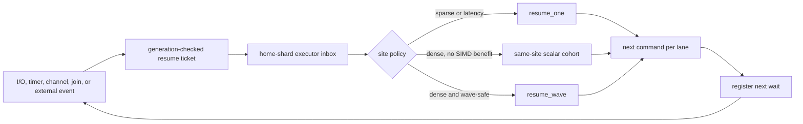

# LLAM Causal Wavefront Execution

Status: research design

Date: 2026-07-26

Short name: LCWE

## Decision

LLAM should research a second, compiler-facing execution plane named **Causal
Wavefront Execution**. The existing stackful C task plane remains the default
and keeps its current ABI and scheduling fast paths.

LCWE changes the unit carried through a wait from an opaque runnable task to a
typed **resume ticket**:

```text
(instance, generation, resume site, frame layout, event cell, home shard)
```

Because the code identity is known before completion, LLAM can route ready
continuations directly into a same-site cohort and choose one of three execution
modes:

1. direct or scalar resume for sparse and latency-sensitive work;
2. a scalar cohort that amortizes admission and dispatch overhead;
3. a compiler-generated wave callback that resumes several independent frames
   together and may use CPU SIMD.

The flagship idea is not batching alone. It is the combination of
completion-carried code identity, LLAM-owned cross-platform wait backends,
implicit same-site cohorting, and runtime selection between direct, scalar
cohort, and vector wave execution through a language-neutral C ABI.

## Motivation And Evidence

LLAM already has most of the mechanisms needed for the sparse side of the
design:

- a C11 stackful N:M scheduler;
- direct task-to-task yield and wake handoff;
- hot, normal, and cross-shard injection lanes;
- generation-protected wait and I/O ownership;
- io_uring, kqueue, and IOCP completion backends;
- a watchdog-attached observe/probe/rollback autotune loop.

A local macOS arm64 diagnostic run showed that the current direct handoff policy
improved `channel_pingpong` by about 29.6% and `spawn_join` by about 25.6% over
the all-handoff-off variant. It also reduced `select_park_wake` throughput by
about 17.7%, while changing `io_echo` by only about 1.4%. These are not general
competitor claims, but they support three design conclusions:

- avoiding scheduler round trips is valuable for causal pairs;
- one global handoff policy is not suitable for all wake sites;
- the separate I/O-node completion path needs a different optimization than
  same-shard task handoff.

LCWE targets dense readiness, where many independent instances return to the
same compiler-known continuation segment. Examples include protocol parsing
after socket reads, storage/RPC completions, actor message handlers, timers,
and language-generated async state machines.

The cost hypothesis is:

```text
scalar: N * (admission + dispatch + scalar segment)
wave:   cohort admission + one dispatch + pack/unpack + N * vectorized segment
```

LCWE wins only when removed per-instance dispatch work and any SIMD savings
exceed cohort formation and packing costs. The runtime must therefore retain a
cheap scalar fallback and measure each site independently.

## Scope

### In Scope

- a separate experimental Executor ABI with size-prefixed C structures;
- compiler- or adapter-generated stackless continuation frames;
- I/O, timer, yield, and one-shot external wake commands;
- completion-carried resume tickets;
- per-shard same-site cohort formation without hot-path allocation;
- scalar, scalar-cohort, and optional wave callbacks;
- site-local adaptive mode, width, and coalescing selection;
- deterministic scalar reference execution for validation;
- Linux, Darwin/BSD, and Windows completion routing.

### Out Of Scope

- transparently vectorizing arbitrary existing stackful C tasks;
- replacing LLAM's stackful task plane;
- actor semantics, supervision trees, or Erlang compatibility;
- allowing C++ exceptions or language panics to unwind through the C ABI;
- promising speedups for sparse, blocking, or shared-state-heavy workloads;
- moving garbage collectors or a universal object model in the first version;
- GPU execution;
- declaring patent novelty or claiming that competitors cannot reproduce the
  design.

## Prior Art And Differentiation

The individual ingredients have prior art:

- Go integrates network polling with goroutine selection and can return a ready
  goroutine directly from the poll path.
- LLVM splits async coroutines into per-suspend resume functions but leaves
  control transfer and scheduling to the frontend.
- Cimple and CoroBase interleave CPU coroutines to expose memory-level
  parallelism in specialized data-processing workloads.
- BATCHER implicitly groups blocked data-structure operations.
- GPU coroutine work groups instances by subroutine for wavefront execution.
- P2300 exposes explicit bulk execution.
- Rust `RawWaker` provides an opaque per-task wake vtable.

LCWE is deliberately narrower than a claim that any one of those ideas is new.
Its differentiated system contract is:

```text
general-purpose CPU runtime
+ language-neutral Executor ABI
+ ordinary stackful C fallback
+ OS-wait completion carrying compiler resume identity
+ implicit per-site scalar/SIMD cohorting
+ site-local direct-versus-wave adaptation
```

The reviewed systems do not expose that complete contract as a general runtime
backend. GPU wavefront scheduling is the closest conceptual analogue, but it
does not provide a cross-language CPU executor integrated with io_uring,
kqueue, IOCP, stackful C compatibility, and a latency-preserving scalar mode.
This is a defensible product and research position, not an uncopyability claim.

Primary references:

- [Go runtime network poller](https://go.dev/src/runtime/netpoll.go)
- [Go runnable selection](https://go.dev/src/runtime/proc.go)
- [LLVM coroutines](https://llvm.org/docs/Coroutines.html)
- [Cimple](https://arxiv.org/abs/1807.01624)
- [CoroBase](https://arxiv.org/abs/2010.15981)
- [Implicit batching with BATCHER](https://robertutterback.github.io/assets/pdf/batcher.pdf)
- [GPU Coroutines](https://sites.cs.ucsb.edu/~lingqi/publications/paper_siga24gpucoroutines.pdf)
- [Rust `RawWaker`](https://doc.rust-lang.org/std/task/struct.RawWaker.html)
- [P2300 `std::execution`](https://www.open-std.org/JTC1/SC22/WG21/docs/papers/2024/p2300r8.html)

## Execution Architecture



### Two Execution Planes

The **Fiber Task plane** remains the current `llam_task_t` implementation:
stackful contexts, current hot/normal/inject queues, direct handoff, task
groups, channels, and blocking helpers.

The **Compiler Continuation plane** uses a language-owned frame and an
LLAM-owned instance wrapper. Each resume callback executes one segment, from
the current resume site until the next suspension or terminal result. Both
planes share runtime stop, cancellation, worker capacity, I/O nodes, timers,
and fairness accounting, but they do not share a public task handle in the
research version.

### Completion-Carried Resume Ticket

Each executor instance embeds one reusable ticket. Registering a wait fills the
ticket with:

- the instance and current lifecycle generation;
- the next resume-site index and frame-layout identity;
- the event result cell;
- the home shard and scheduling class;
- intrusive links needed by ready admission.

An I/O request, timer, or external waker retains the ticket rather than
discovering a callback after completion. A successful completion writes the
event, performs the single `WAITING(g) -> READY(g)` transition, and routes the
ticket to its home shard. A stale generation or losing completion retires its
backend ownership without enqueueing work.

I/O-node and foreign producer threads never execute user continuation code.
Only a scheduler worker may invoke a resume callback.

## Executor ABI V1

The Executor ABI is negotiated separately from LLAM ABI 2.0. One exported query
entry returns a size-prefixed function table:

```text
llam_executor_query(requested_version, out_api, out_size)
```

This prevents an experimental compiler contract from destabilizing the existing
stackful public ABI. The returned table contains module registration,
instance lifecycle, cancellation, external wake, and stats-query operations.
Every public input structure starts with `struct_size` and reserved-zero fields.
The same prefix rule applies to output structures and callback-visible event and
command structures.

### Module

A module represents one language runtime, generated object, or compiled module.
Its descriptor contains:

- module context;
- an array of resume-site descriptors;
- frame destruction callback;
- optional diagnostic names;
- ABI feature and safety flags.

LLAM copies site descriptors during registration. Module unregistration returns
`EBUSY` while any instance, outstanding ticket, backend request, or callback can
still refer to its code.

### Resume Site

A site descriptor contains:

- stable site index;
- frame-layout identity;
- scalar callback;
- optional wave callback;
- supported lane-width mask;
- safety and scheduling flags;
- optional ready-to-run latency budget, with zero selecting the runtime
  profile's default.

Conceptual callback forms are:

```c
resume_one(module_ctx, frame, event, command)
resume_wave(module_ctx, frames[], events[], commands[], lane_count)
```

The wave callback is optional. Initial supported widths are 2, 4, 8, 16, and
32 lanes, capped at 32 by the runtime. A compiler may implement `resume_wave`
with vector IR, a vector-predicated loop, hand-written SIMD, or an optimized
scalar loop.

### Instance And Frame Ownership

The language adapter owns allocation and layout of the frame. LLAM owns the
instance wrapper, lifecycle word, ready link, ticket, one reusable event cell,
one embedded I/O request, one embedded timer node, wait ownership, and
diagnostic state. One instance may have only one active suspension command, so
the common wait path does not allocate.

Frames are nonmoving and distinct by default. LLAM calls `drop_frame` exactly
once after the instance is terminal and all backend and external-waker
references are retired. Relocatable frames and GC root maps are deferred.

### Events

An event is a small tagged result cell. Initial event kinds cover:

- start and explicit yield;
- timer expiration;
- I/O result or errno;
- cancellation;
- external one-shot wake;
- runtime stop.

Large payloads remain in language- or LLAM-owned buffers referenced by the
event; the ready path does not copy arbitrary payloads.

Language-owned I/O buffers and address structures passed by a wait command must
remain pinned and valid until that wait's terminal event. Alternatively, an
adapter may request an LLAM-owned buffer whose ownership is returned in the
event. The generation handshake prevents reuse of an embedded request but does
not make prematurely freed foreign memory safe.

### Commands

Each callback emits exactly one command per lane:

- `YIELD`;
- `WAIT_TIMER`;
- `WAIT_IO_READ`, `WAIT_IO_WRITE`, `WAIT_IO_POLL`;
- `WAIT_IO_ACCEPT`, `WAIT_IO_CONNECT`;
- `WAIT_EXTERNAL`;
- `COMPLETE`;
- `FAIL`.

Every nonterminal command includes `next_site`. `WAIT_EXTERNAL` creates a
generation-stamped, one-shot wake handle through a caller-provided output cell.
Channels can initially integrate through `WAIT_EXTERNAL`; native executor-aware
channel tickets are a later optimization after the core hypothesis passes.

LLAM initializes command slots to `FAIL/EPROTO` before invoking callbacks.
Invalid or unwritten commands fail only their lane and are never retried after
user state may have mutated.

## Execution Semantics

For a site to advertise a wave callback, executing one wave must be
observationally equivalent to executing `resume_one` once for every lane in
FIFO lane order, or to another scalar interleaving permitted by that language's
memory model.

The compiler or adapter must select scalar execution when it cannot establish
that contract. Address-exposed state, shared noncommutative effects, FFI calls,
unknown aliasing, and order-sensitive atomics are scalar unless the generated
wave callback explicitly preserves their ordering.

Additional rules are:

1. a callback runs without a shard queue lock held;
2. a callback must not block an OS worker;
3. a segment ends at exactly one suspension or terminal command;
4. exceptions and panics become lane-local `FAIL` commands;
5. no exception unwinds across the C ABI;
6. a partially executed wave is never retried;
7. in-process native-code faults retain the same process-failure boundary as
   ordinary C code;
8. cancellation before `RUNNING` prevents lane admission; cancellation during
   `RUNNING` is observed at the next boundary.

## Lifecycle And Exactly-Once Wake

An executor instance follows:

```text
NEW -> READY -> RUNNING -> WAITING -> READY -> ...
                         \-> TERMINAL -> RECLAIMED
```

State and generation are published together in one atomic lifecycle word. A
new wait advances the generation. I/O completion, timeout, cancellation, and
external wake compete to change `WAITING(g)` to `READY(g)`. Exactly one wins.
The winner owns event publication and ready enqueue; losers only release their
own retained references.

Transitioning to `TERMINAL` prevents new waits and external wakes. Reclamation
requires terminal state, zero active callback, zero backend references, and zero
external-waker references.

The lifecycle word uses a 64-bit nonzero generation. Exhausting that generation
space retires the instance instead of wrapping it back to a value that a stale
producer could hold.

## Per-Shard Ready And Wave Structures

Each shard gains a separate executor admission path so existing fiber queue
layouts and hot-path decisions remain intact:

- a fixed-capacity sequence-numbered MPSC ring for remote ready tickets;
- an intrusive, allocation-free overflow queue for ring saturation;
- a latency/scalar FIFO;
- a fixed-size open-addressed site table;
- a fixed min-heap of active partial-bucket deadlines;
- full-wave and expired-wave queues;
- scheduler-local arrays for at most 32 frames, events, and commands.

Local scheduler-generated wakes bypass the MPSC ring. The research default site
table is 256 entries per shard and may be configured before runtime start.
Only empty entries can be evicted. Table saturation falls back to scalar
execution and never drops a wake.

A site-table key is:

```text
(module handle, site index, frame-layout identity, scheduling class)
```

Each bucket stores an intrusive FIFO of tickets, count, oldest-ready time,
target width, deadline, policy state, and sampled counters. Detaching a wave
does not allocate.

### Shard Placement And Migration

An instance has one home shard at a time. Formed waves are not stolen because
moving a partially formed site cohort would add synchronization to the common
path. Load balancing may choose a new home shard only while processing a
suspension command, before publishing its next ticket.

Dynamic shard offlining first stops new placements, then rehomes waiting
tickets and their backend owner at a generation-protected boundary. A ready or
running instance pins its shard online until the next suspension or terminal
boundary. This preserves exactly-once completion routing without introducing
mid-callback migration.

## Admission And Coalescing

The runtime never sleeps or spins to fill a wave.

- A latency-class site has zero intentional coalescing delay.
- A balanced site starts with a maximum 2 microsecond delay.
- A throughput site starts with a maximum 10 microsecond delay.
- A full target width becomes runnable immediately.
- An expired partial bucket runs at its current width.
- If no other work is runnable, the oldest partial bucket flushes immediately.
- An already-ready cohort may use a wave callback even when intentional delay
  is zero.

Sites without a wave callback still use scalar execution. They may use scalar
cohort dispatch if measurement shows that draining several instances under one
scheduler selection reduces overhead.

## Scheduler Fairness

Due timers and cancellation are serviced before ordinary dispatch. Latency
scalar work has a deadline override. Otherwise, fiber and executor work share a
time-based deficit round-robin budget rather than a permanent priority order.

Initial hard guardrails are:

- after two consecutive wave callbacks or 50 microseconds of wave time, run one
  waiting fiber or scalar item when available;
- preserve the existing direct-handoff burst guards;
- promote an item whose ready age exceeds its class budget;
- drain both fiber and executor remote ingress with bounded work per loop;
- include executor-ready and executor-live counts in runtime drained, pressure,
  dynamic-shard, idle-wait, stop, and deadlock decisions.

The primary and opaque-helper scheduler loops must call the same dispatch
primitive. LCWE must not be added to only one of the duplicated loops.

## Site-Local Adaptation

Policy is local to a `(shard, site key)` entry:

```text
COLD/SCALAR -> PROBE -> WAVE -> COOLDOWN
                           \-> rollback
```

Hot paths update cheap counters. Timing is sampled, initially one in 64
dispatches. A shard evaluates its own site policies at scheduler safe points;
the watchdog only publishes global observe/on/frozen mode and safety limits.
This avoids cross-thread mutation of site buckets.

Sampled inputs include:

- arrival rate and ready width;
- scalar and wave callback elapsed nanoseconds per lane;
- fill ratio;
- coalescing and ready-to-run latency distributions;
- callback duration and over-budget count;
- failures, cancellations, stale completions, and scalar fallbacks;
- next-site dispersion.

A policy decision requires at least 4,096 lanes or 100 milliseconds of
observation. Width changes by one supported step at a time.

- Commit a larger width only with at least 10% sampled per-lane improvement and
  latency inside budget.
- When fill ratio is below 60%, reduce width before considering more delay.
- Halve coalescing delay immediately when p99 exceeds the site budget.
- Roll back to scalar after two consecutive regressing windows.
- Enter cooldown after rollback or repeated callback over-budget events.
- Missing policy state, insufficient evidence, or table pressure is scalar.

Manual `scalar`, `wave`, and fixed-width modes remain available for benchmarks
and diagnosis. Autotune results are not accepted without fixed-policy
comparisons.

Online callback timing uses sampled monotonic elapsed time, not thread CPU time.
Whole-process CPU nanoseconds per operation remain an offline benchmark metric.

## I/O Integration

The current `llam_io_req_t` directly stores a `llam_task_t *` and all three
platform completion paths call task reinjection. LCWE requires an internal,
nonpublic completion-target abstraction with a target kind and union:

```text
fiber task | executor resume ticket
```

The existing fiber branch continues to call the current reinjection logic. The
executor branch publishes its event and admits the ticket. It must use a
predictable direct branch rather than an indirect user callback on the I/O-node
thread.

Linux io_uring CQEs, kqueue events, and IOCP completion batches can naturally
produce several tickets before a scheduler dispatch. The first implementation
does not move user execution onto I/O-node threads. Scheduler-integrated polling
is a separate future optimization and is not required to prove LCWE.

## Error Handling And Isolation

- Registration validates structure sizes, reserved fields, site indexes,
  lane-width masks, required callbacks, and module limits.
- Command validation occurs before LLAM registers the next wait.
- Invalid commands terminate the affected lane with `EPROTO` and increment a
  quarantine counter.
- Repeated structural callback errors disable wave execution for the site.
- Stale completion and cancellation races are counted but are not fatal.
- Allocation failure during instance creation is reported before execution;
  ready, completion, cancellation, and stop paths do not allocate.
- Module unload is rejected with `EBUSY` until all code references retire.
- In-process arbitrary memory corruption is not treated as containable. Hostile
  modules require LLAM's broker process boundary in a later design.

## Observability

Always-available aggregate counters include:

- executor instances created, live, terminal, and reclaimed;
- resume tickets completed, stale, canceled, and overflowed;
- scalar resumes, scalar-cohort lanes, wave calls, and wave lanes;
- wave width histogram and average fill;
- site-table misses and scalar fallbacks;
- command counts and invalid commands;
- callback over-budget events and policy rollbacks.

Sampled per-site diagnostics include scalar/wave nanoseconds per lane,
coalescing p50/p99, ready-to-run p50/p99, current mode, target width, cooldown,
and the last policy reason. Debug dumps identify modules and sites by copied
diagnostic names without dereferencing unloaded module memory.

Tracing remains opt-in because full event tracing disables or distorts some
existing direct paths.

## Validation Strategy

### Correctness

- Run every generated workload in forced-scalar and wave modes and compare
  terminal results, emitted command sequences, and permitted ordering.
- Randomly race I/O completion, timeout, cancellation, runtime stop, external
  wake, and module unregister.
- Force lifecycle-generation wrap-adjacent values and recyclable request reuse.
- Test ring and site-table saturation with no lost wake.
- Verify opaque-helper, dynamic-shard rehome, stop, drained, and deadlock paths.
- Run ASan, UBSan, and TSan where supported.
- Build and run native Linux, Darwin, BSD smoke, and Windows IOCP tests.
- Fuzz module descriptors, site descriptors, events, and commands.

### Performance Matrix

Each case runs with scalar executor, scalar cohort, fixed wave widths, autotune,
and ordinary stackful LLAM where semantics allow comparison.

- synthetic empty and arithmetic resume segments;
- protocol-header parsing after batched socket reads;
- RPC/storage-style completion plus state transition;
- timer fanout;
- external event fan-in;
- homogeneous one-site load;
- 80/20 site distribution;
- uniform 8-site and 32-site distributions;
- lane counts from 1 through 32;
- low, medium, and overload arrival rates;
- wave-safe compute, pointer-heavy compute, and scalar-only shared effects;
- mixed stackful fiber and executor load.

Measurements include throughput, wall latency p50/p99, whole-process CPU
nanoseconds per operation, context switches, wake syscalls, wave fill,
ready-to-run delay, and peak RSS.

Existing `spawn_join`, channel, select, timer, poll, I/O, blocking, and shutdown
benchmarks remain regression gates.

The three representative batchable workloads used by the main throughput gate
are fixed before optimization:

1. `exec_io_pipeline`: batched socket reads, framed-header validation and
   checksum/state update, followed by a write command;
2. `exec_rpc_state`: storage/RPC-style completions followed by branch-heavy
   decode and a multi-step request state transition;
3. `exec_event_fanout`: timer and external-event fan-in followed by an
   arithmetic state machine and rescheduling.

Empty callbacks, a single hand-written arithmetic kernel, and workloads whose
scalar and wave versions implement different semantics cannot satisfy the main
gate.

### Research Success Gates

LCWE proceeds beyond experimental status only if all of these hold:

1. at least two of three representative batchable workloads achieve 1.5x
   throughput and at least 30% lower CPU nanoseconds per operation versus the
   scalar Executor ABI path;
2. scalar cohort alone demonstrates a measurable dispatch-amortization win,
   proving that gains do not depend entirely on one hand-written SIMD kernel;
3. p99 latency degradation is at most 10% under balanced mode;
4. low-load and mixed-site throughput regression is at most 5%;
5. the existing stackful benchmark geometric mean regresses by at most 3%, with
   no individual unexplained regression over 5%;
6. no hot-path allocation is observed after instance and module setup;
7. forced-scalar and wave correctness tests remain equivalent on all supported
   primary platforms.

The hypothesis is rejected or redesigned if gains appear only in empty
microbenchmarks, fewer than two representative workloads pass the throughput
gate, the I/O completion abstraction materially regresses existing fibers, or
latency guardrails require wave mode to remain disabled in realistic load.

## Research Phases

1. **Cost-model harness:** model resume tickets and measure scalar dispatch,
   scalar cohort, and hand-written wave callbacks without public ABI changes.
2. **Scalar Executor ABI:** prove lifecycle, module ownership, command
   validation, cancellation, and external wake semantics.
3. **Completion target:** add the generic internal task-or-ticket target and
   verify unchanged fiber behavior on all three I/O backend families.
4. **Wave scheduler:** add fixed per-shard site tables, cohort dispatch,
   fairness, saturation fallback, and forced policies.
5. **Compiler proof:** build one manual C adapter and one LLVM-generated
   continuation adapter with scalar and vector resume functions.
6. **Autotune:** enable sampled per-site probe, commit, rollback, and latency
   guards only after fixed-policy data is available.
7. **Product decision:** compare against the success gates before documenting a
   stable public Executor ABI or assigning a release version.

Each phase has a stop point. No release claim is made from the ABI skeleton or
synthetic microbenchmark alone.

## Architectural Consequences

LCWE makes LLAM a runtime backend rather than only a fast C fiber library.
Compilers can still emit ordinary scalar continuation code, while capable
frontends provide wave callbacks and safety metadata. Existing C applications
continue to use the stackful plane unchanged, and C code may opt into the
Executor ABI manually.

The defining LLAM abstraction becomes:

> A wait does not merely wake a task. It carries the exact continuation that the
> event enables, allowing the runtime to choose the cheapest legal execution
> shape at the moment of readiness.
